### Overview Steps
---
1. requirement clarifications
2. back-of-envelope estimation
    > estimate the scale, help focus on scaling, partitioning, load balancing, caching
3. system interface definition (API)
4. define data model
    > to clarify how data flow among system components
5. high-level design
6. detailed design
7. identify and resolve bottlenecks

#### Five Key
1. [Scalability](https://lethain.com/introduction-to-architecting-systems-for-scale/)
1. Reliability: `avoid single point failure`
3. Availability: `time system remain operational`
4. Efficiency: `latency+throughput`
5. Serviceability
#### Load balancing
- help **Horizontal Scale**
- balance the load at **each layer of system**
- LB algorithm: `Least Connection, Least Latency, Least Bandwidth, Round Robin, Weighter Round Robin, IP Hash`

#### Cache
> - locality: recently requested data is more likely to request again
> - often at the level nearest to front end
- Application Server Cache: can be global and distributed caches
- CDN: for site serving large amount of **static media**
- [Cache Invalidation](https://liqiang.io/post/cache-consistence-describe-with-python): `Write-Back, Write-Around(freq), Write-Through`

- **Cache eviction policy** `FIFO, LIFO, LRU, LFU, MRU, RR`

#### Data Partitioning
> - to split up a DB across machines
- Partitioning Methods
> - **Range-based** VS **Hash-Based**
    1. Horizontal Partitioning: split rows (**Data Sharding**)
    2. Vertical Partitioning: split feature
    3. Directory Based: create a lookup service
- Partition Criteria:
    1. Key/Hash-based: hash func some attributes to get ID, **Consistent Hashing** deal with adding new servers and rehashing
    2. others: List, Round-robin, composite
- Problem:
    1. Joins: need to de-normalization
    2. Referential integrity: RDBMS cannot do it
    3. Re-balancing

#### Index
> - To increase read performance; usually B/B+ tree;
> - Might decrease performance since we need to maintain index on writing &rarr; write-bound db does not suit for index

#### Proxy
> - intermediary to filter/log/transform requests from client
- Open proxy: accessible by anyone; Normal Proxy: accessible by a group of users within a network
    - Anonymous Proxy: hide initial IP; Transparent Proxy: reveal IP, support cache
- **Forward proxy** `VPN` for client to bypass firewall to access forbidden site, normally like VPN access bypass “Great Wall”, client real IP is hidden; it also provide cache server
- **Reverse proxy** `Nginx` for server to achieve HA and Load balance, meaning that real server worker IP is hidden from visitor, all exposed to visitor is Public IP of web server like Nginx [helper](https://www.linuxbabe.com/it-knowledge/differences-between-forward-proxy-and-reverse-proxy)

#### Replication VS Redundancy
> - Redundancy is to **failover** as HA;
> - Replication is to share info to ensure data consistency among master&slaves: `client --write--> master --write--> slaves (only process next update on this succeed)`

#### CAP, Cache, Consistent Hash
> - [link](https://novoland.github.io/cache/2014/07/26/Cache%20%E7%9B%B8%E5%85%B3%E7%90%86%E8%AE%BA.html)
- Consistent Hash with **Virtual Replicates** &rarr; uniformly distribute keys

### Mixed
---
> - if you need a unique key across system, considering about Key-Generation-Service/DB
> - [reference](https://blog.csdn.net/liuben/article/details/17973039)
- **Object-based Storage** scalability + availability + reliability + hight throughput
    - Object: `OID + Data + Metadata + Attributes`
    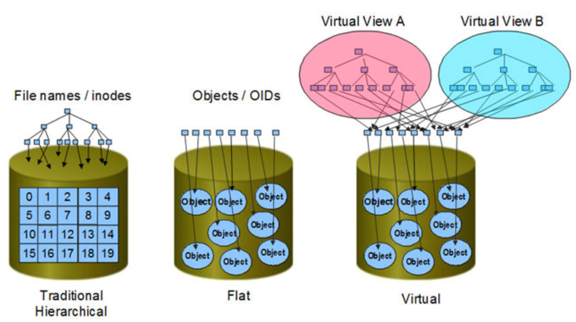
    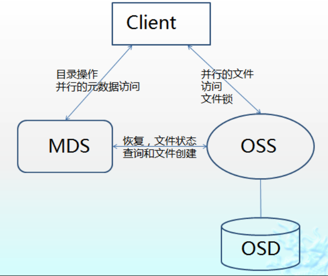
    > - **SAN** hight throughput but not scalable
    > - **NAS** scalable but low throughput (TCP/IP, file-trans protocol)
- metadata: data of data; description of the content, can be segregated from content in storage
- **Cassandra**: **wide-column stores**
    1. 2d的key-value存储，即整个数据模型被定义成一个类似`map<key1, map<key2,value>>`
    2. to store **relations**
- Maintain Message order:
    > - Chat: no consistent global order, **User sort msg on its own seq**, will see different order** [ref](https://developer.aliyun.com/article/713316)
    > - Group-Chat: same as p2p Chat, only maintain group-order &rarr; force all messages belong to a group process by the same server &rarr; local server seq generation
### Example
---
#### URL shortening
- **Encoding** URL? no, to get a unique_key from **KGS**
- **KGS** maintain a pre-generated Key-DB; **2 tables: used + not used**; move key to **used-table** once KGS writes it into **memory cache**
- lazy cleanup
#### Instagram
- **split READs and  WRITES**
- **KGS** for photoID, odd&even for primary/secondary
- **DB** for U2U and U2P: **wide-column** datastore like Cassandra: `{user-id: list-of-photo-id}`
- **NewsFeed** *Pre-generate + TopK*
    - Send NewsFeed: **PULL vs PUSH vs Hybrid**
    - To support TopK: photoID combine with epoch time
- **Cache** CDN for photo, memcache for metadata

#### Dropbox
- Client internal components: `Control Flow` and `Data Flow` are segregated
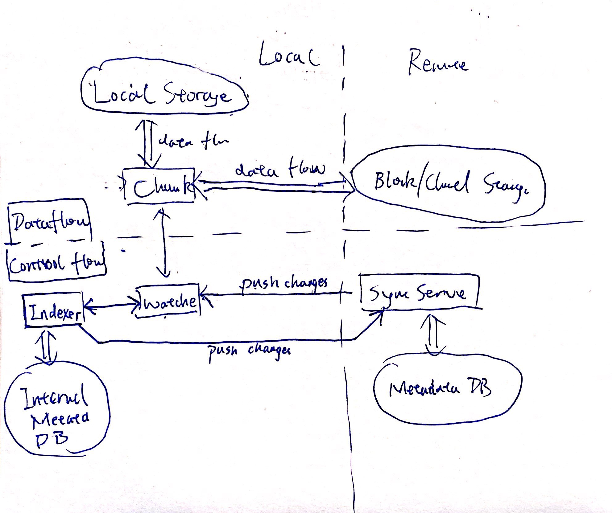
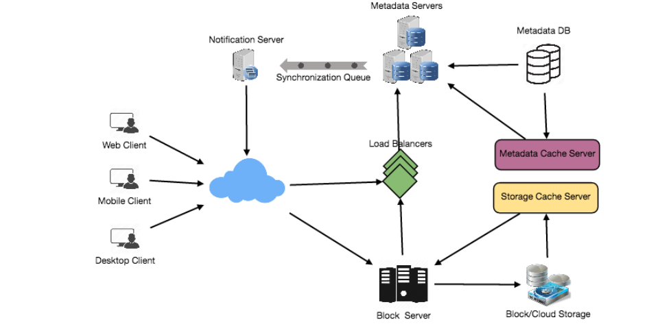
- Client directly connect to **Block server** and **Sync servers LB** &rarr;
    1. `Client` updates chunks to `Block server` &rarr; sends metadata commit to `Sync Server` &rarr; wait for ACK
    2. `Client` receives metadata changes &rarr; download the updated chunks from `Block Server`
- Message Queue: 1 request queue + N response queue

#### FB Messenger
- Ordering of message, using **seq_id** generated locally
- **DB**: **wide-column DB** like HBase, which group data and store in memory buffer until buffer is full, dump to disk
- **User Status**: client only pull user status in **friend-list + viewport**; server broadcast user status after a delay
- **Group chat** data in separate table and server, which will iterating all servers handling connections to members
- **Notification server**
##### Instant Message
> [ref](https://developer.aliyun.com/article/698301)
- **First Storing Then Sync**
- **Push Model** each uer has a receiver TimelIne queue
- Need two type of timelines: **sync** and **storage** &rarr; **SYNC Timeline** item inside has life-cycle, unlike **Storage Timeline**
    > 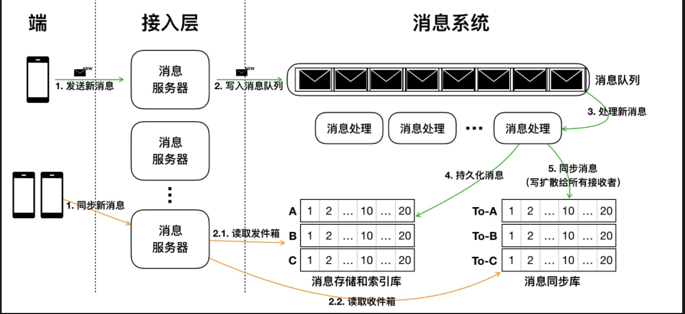
#### FB NewsFeed
- feed generated and stored in cache; periodically generating
    - FeedItem for each user storing in **TreeMap**
    - **Evict User** from Feeds Memory using LRU/LFU/UsingPattern
- 2 types of Application server
    1. update/storing new posts **pre-generate** + `LRU`/`login pattern`
    2. retrieve and push NewsFeeds: **Pull vs Push vs Hybrid**
        - **another approach**: `push to notify && pull for serving`

#### Youtube
> - segregate read and write traffic
- read traffic **master-slave** &rarr; data staleness (master hasn't write to slave while salve receives requests) **acceptable**
- **Encoder**: to encode all format, this requires a **message queue** between app-server and encoder
- **Thumbnail Generator**: generate preview of video
    - Huge read traffic on previews + previews is small file &rarr; **Bigtable** as the storage system + **cache hot thumbnails**
- Data Sharding on VideoID, just like Tweet &rarr; **aggregator server** needed
- **Video Duplication** &rarr; ==TAKE IT EARLY== run followings while uploading: `video matching algorithm` + `chunk uploading offsets`
- *redirect to same cache location*
- **CDN cache**: geographic local server cache + cache popular
    > 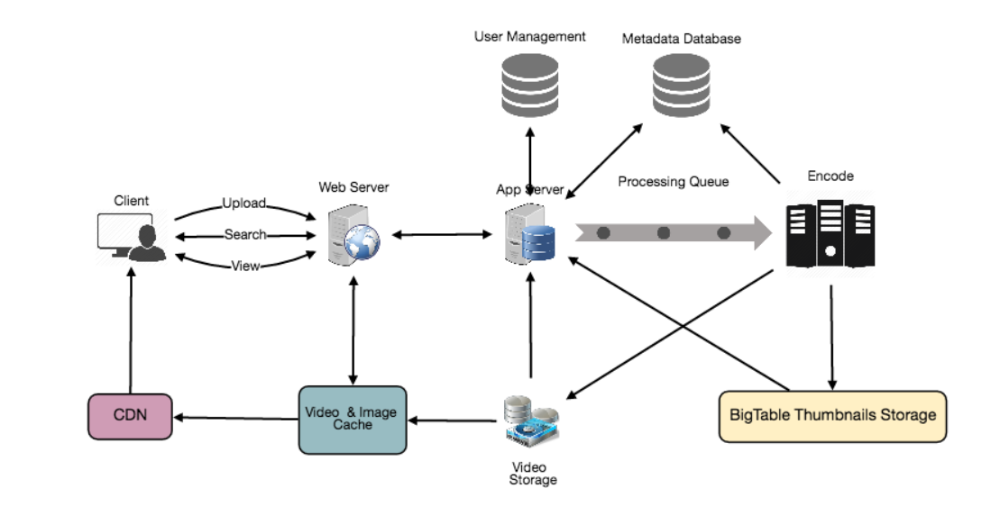

#### Typeahed
- **Trie**
    - **Speed up**: `store suggestion on each node`: for each node, store **a min-heap of pointers** to **terminal nodes** rooting at the current node; to return the suggestion, start from the terminal node and **traverse back**
    - `insert a new node`: need update some node's top-10. Start at the **new terminal node**, travel back to root, update all intermediate nodes' top 10
- **Update offline** after a while `avoid affect real-time read`
    1. server make trie snapshot/copy and update offline
    2. or **master-slave switchover**: master serve, salve updates, then switchover
- **filter layer** before server
- Store Trie in file: for rebuild after recover; **Tree Serialize and Deserialize**
- **Data Partition**: `static range based` vs `on server memory capacity` vs `hash based (KGS)`
- Client side improvement: `pre-fetch` + `local history` + `early connection` + `CDN`

#### API Rate Limiting
- **Fixed Window** VS **Sliding Window** VS **Sliding Window with Counter**
    1. Fixed Window: `user_id -> <start_time, count>`
    2. Sliding Window: `user_id -> multi_set<timestamp>` un-scalable
    3. Sliding Window with Counter: `user_id -> map<time, count>` ==each has TTL== **only maintain a FIX-SIZE window per user per API**
    > - It relies on percentage calculation [link](https://hechao.li/2018/06/25/Rate-Limiter-Part1/)
    > - It assumes the distribution of requests in previous window is even
    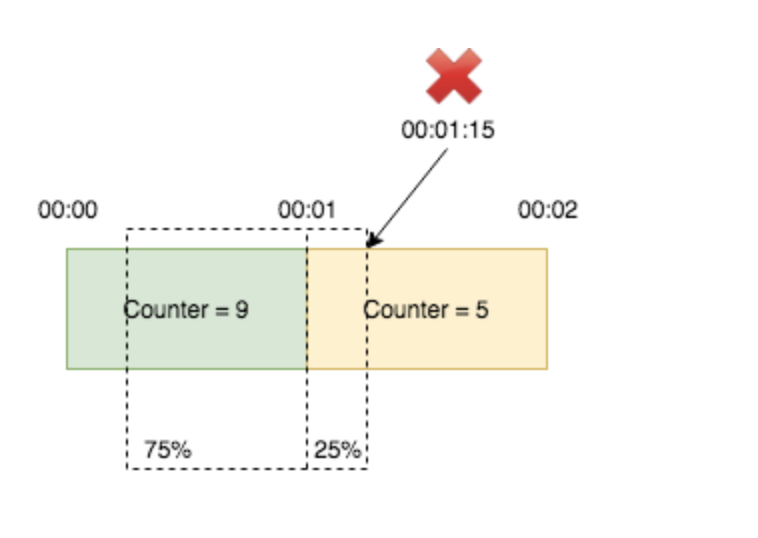

#### Twitter
- read-heavy
- **Data Sharding** based on TweetID &rarr; find tweets need **query all servers**
    - Issue on Creation-time based sharding(*it avoid querying all*): **not distributed**, server storying latest tweets is flooded. 👉 combine **TweetId and timestamp**: though still query all, but **PrimaryKey** containing timestamp speeds up query
- Reduce high latency: **Distributed Cache** with help of LB
    - format `<user-id, double-list-of-tweets>` like LRU
- **ML** module on **suggestion**: shuffle and re-prioritize, need **signals**
#### Twitter Search
> analogy: User == Index
- **Index**: big distributed hash table: `<key-word, list-of-tweetID>`; to store all need distribute
    - *Sharding on word*: only need query one server, but will overloaded + not uniform distributed
    - **Sharding on tweet**: need query all servers. introduce **aggregator**
- **index server**: a distribute table mapping word to tweets
- What if both primary/secondary index servers die?
    - to allocate a new and rebuild index
    - **index-builder server**: reverse mapping: `<index server, hash-set-of-tweetID>`
- **Cache** is before **aggregator**
    > 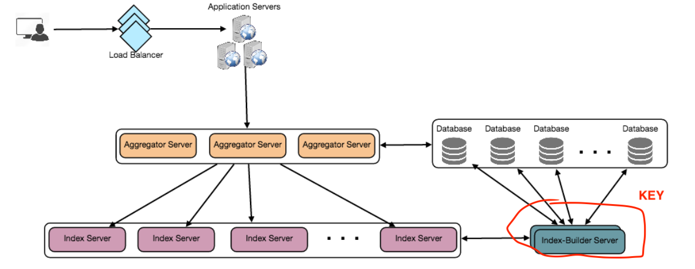

#### Crawler
- Modular, **Document Input Stream**
> Single worker thread
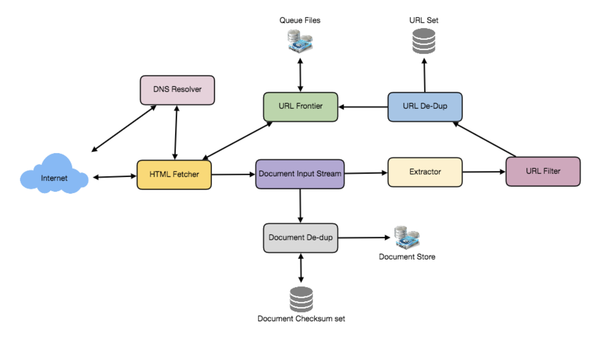
- `URL Frontier`: hash1: `URL->server`; hash2: `URL->worker_thread`; **each worker thread has own sub-queue** + buffer of enqueue/dequeue
- `Fetcher`: fixed-size cache
- `DIS`: **1 DIS per worker** stream cache of all document, pass by reference between different modules
- `Document De-dup` checksum by MD5/SHA, LRU + back store
- `URL De-dup` checksum + **Bloom Filter**
- **Crawler Trap** detect dynamic page/cycle + set depth limits
#### Yelp
- Grids &rarr; **QuadTree** (2-d segment tree)
    > - only leaf contains list of locations info
    > - lookup neighbors: **leaves connect with DList** or **parent point**
- Data Partition: By Region + Consistent Hashing; By LocationID `introduce aggregator`
> QuadTree Index Server
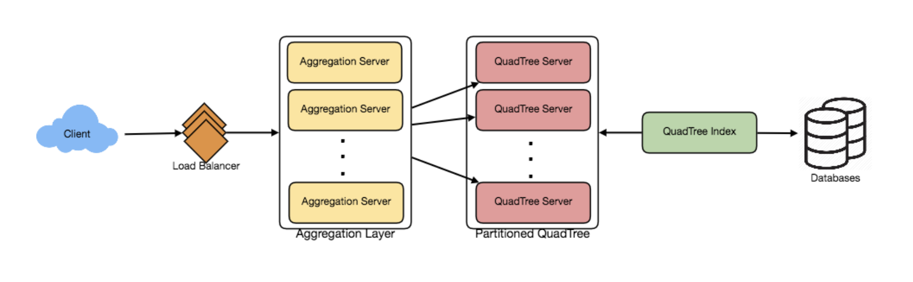
#### Uber
> - **Challenge**: make driver and customer get real-time location updates
- **QuadTree issue**: modify requests > read request &rarr; **DriverLocation HT** record latest location, update QuadTree later with less frequency
- **Notification server**: `PUSH model` publisher/subscriber &rarr; Each driver in **DriverLocation HT** maintains a list of *interested customers*
- **New driver get into area Case** Instead of using `Pub/Sub` model, let customer pull, this is transferring from **PUSH model** &rarr; **PULL model**
- **SSDs** to store DriverLocation HT: fast I/O + recovery from SSDs(persistent storage)
> Push Model
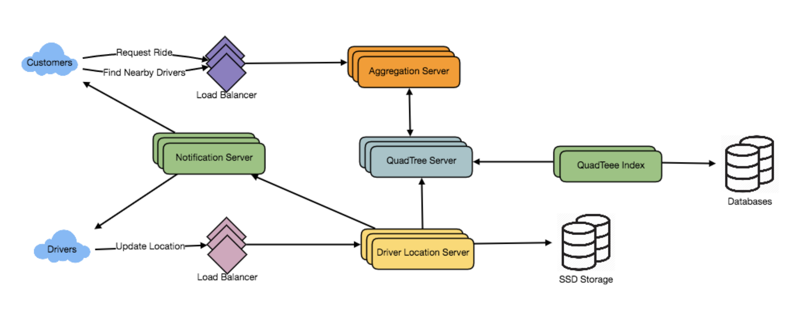