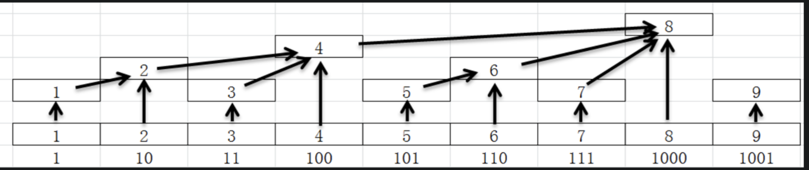
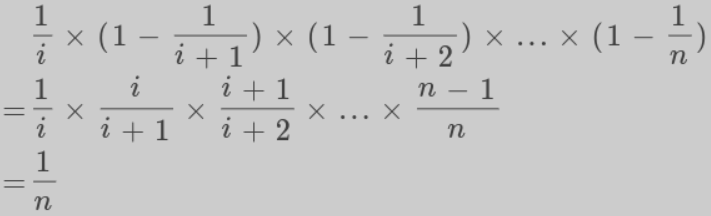
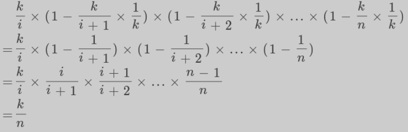

### Quick Select
> - **core** 选择pivot，将其放在correct pos
> - **step** each round run **partition** &rarr; `left part <= pivot => right part` &rarr; **Divide&Conquer**，recursive call sort(left, right)
> - **partition** 写法, two pointer [link](https://novoland.github.io/%E7%AE%97%E6%B3%95/2014/08/05/%E5%BF%AB%E9%80%9F%E6%8E%92%E5%BA%8F.html)
``` c++ {.line-numbers}
auto pivot = a[left], i=left, j=right; //trick
while (i<j) {
    while (i<=j && a[i] <= pivot) ++i; // must  i<=j, find left-most invalid i
    while (i<=j && a[j] >= pivot) --j; // must i<=j, find right-most invalid j
    if (i < j) swap(a[i], a[j]);
}
swap(a[left], a[j]); // put pivot on right position
return j;
```
> 注意inner while loop 中 i<=j，否则 i, j 不会交错，逻辑错误

## Heap
> - 处理k-distance/window问题，freq+pq
> - [head theory](https://www.cnblogs.com/vamei/archive/2013/03/20/2966612.html) **完全二叉树** `insert`: append to last pos, **switch up**; `deletion`: replace root with last node, **switch down** until last 成为leaf或者优先度大于children
> - priority_queue的排序机制的写法和vector的sort的排序机制的写法正好顺序相反
> - lambda, 非lambda [comparator override](https://stackoverflow.com/questions/2620862/using-custom-stdset-comparator)：适用stl, priority_queue 不同，需要加`vector<type>`
``` c++ {.line-numbers}
// lambda
priority_queue<pair<int, string>, vector<pair<int, string>>, decltype(cmp)> pq(cmp);
// non-lambda
struct cmp {
    bool operator() (const vector<int>& a, const vector<int>& b) const{
        return a.size() > b.size();
    }
};
set<vector<int>, cmp> test;
priority_queue<vector<int>, vector<vector<int>>, cmp> test; // notice vector<type>
map<vector<int>, int, cmp> test2;
```
- *1046. Last Stone Weight* [==Greedy + Heap==] 模拟过程即可，注意每次只需要删去小的，大的剩余为0也可以插入等待之后删除.
- *1167. Minimum Cost to Connect Sticks* [==Greedy + Heap ==] 常规Heap
    > - [不用Heap解法](https://leetcode.com/problems/minimum-cost-to-connect-sticks/discuss/365913/No-PriorityQueue(MinHeap)-just-Sort-exactly-once-(with-detailed-Explanation))
- **857. Minimum Cost to Hire K Workers** [==Greedy + Heap==]
    > - **数学分析** 对于K-group: `w1:w2:... = q1:q2:..`, 其中w为**实际wage**，那么 `TotalWage = wi/qi * TotalQuality`
    > - **KEY-1** 由于每人有min wage 👉 K-group中`Max(W/Q)` 为实际ratio，W为期望wage 👉 `TotalWage = Max(W/Q) * TotalQuality`
    > - **KEY-2** 两个变量，那么固定其中一个 &rarr; sort all worker on Wage/Quality ratio, 然后**sliding window on K worker** &rarr; 对于新加入worker，将带来更大ratio，但quality-total可能降低，所以**sliding window**
    > - **Sliding window with heap** total-quality减去quality最大的人，加入新的worker，update res with `new-tot-quality * new-max-ratio`
- **855. Exam Room** [==Set==] insert 和 erase都是 `O(logN)`, 重点是找到目前距离最大的interval，在其middle point插入
    > - **KEY-1** 核心就是heap的思路，维护一个heap，top为max-distance的线段，`seat`时候取出之，拆成两个子线段，再入pq；`leave`时候需要找到**以此pos为开头和结尾的两个子线段**，remove他们，然后insert merged segment
    > - **KEY-2** 涉及insert和erase，所以pq不行，需要tree-map，即`set`; 同时由于leave需要**快速找到以pos开头结尾的俩子线段**，需要两个`hash-map`投射`start->end, end->start`
    > - **KEY-3** Comparator的写法，此处新建struct 并**overload** `operator <`
    > - **Trick-1** **dummy线段**加入，非常类似linked-list里面dummy node，此处就是整个完整线段`[-1,N]`，此引入 insertion操作的corner case`X==-1; Y==N`
    > - **Trick-2** **排序comparator**， 不是简单的distance比较，注意`case[0, 4, 9]`, 下一次seat为`2 not 6`, 虽然[4,9]线段长，这是因为distance定义是**离自己最近node的最远距离** 👉 为 `(R-L)/2`，同时注意corner case；此外distance相同下看Left

### Top K
- **215. Kth Largest Element in an Array** [==Heap/Quick Sort==] 经典做法就是min-heap维护k个元素，遍历一遍，大于top的先pop再push.
    > **Quick Sort** pick a pivot, QS partition 将其放到right pos，看其index
        > - **KEY: Divide&Conquer** 类似Binary search，根据 index来判断左右移动，继续partition, 直到partition 返回是K
-  973. K Closest Points to Origin [==Heap/Quick Sort==]经典做法，维护一个k size的max-heap
    > - 取巧的写法：不用比较top和当前node，node全部push，然后当`size>k`就pop，维护了窗口里为面的前k小的.
    > - **Quick Sort** 复刻215 quick sort解法
- 347. Top K Frequent Elements [==Heap==] 复刻215, 维护k-size min heap
    > 还可bucket sort，就是建立max_freq大小的bucket，然后将按照freq把数字放入对于bucket [link](https://www.cnblogs.com/grandyang/p/5454125.html)
- 451. Sort Characters By Frequency [==Heap==] 复刻215, 也可以bucket sort
- **767. Reorganize String** [==Heap==] 简化版task scheduler，就是把所以字母按fre入max-heap，每次不断pop出构造string，--freq后若>0又push回pq. **KEY** 每一轮重新push的是上一轮的top，因为要相邻不同char，若直接当轮push当轮，会出现下一次pop也是当前者 **Trick**当发现char feq > (size+1)/2就可以直接返回不可.
    > [法2](https://www.cnblogs.com/grandyang/p/8799483.html) encode char+freq，没啥特别
- **358. Rearrange String k Distance Apart** [==Heap==] 加强版767，做法基本一样，但是需要用一个vector表示当下的size-k window. 做法freq标记后同样全部加入pq，不断pop时候构造string，同时把pop出来的entry入vector，当vector size==k，说明可以清空window，将其中entry重新加入pq，因为其满足k-distance. 最后如果pq空了window里还有剩的，说明没法构造k-distance string
    > `O(n)`**做法**
- *1054. Distant Barcodes* [==Heap==] 复刻767和358
- **621. Task Scheduler** [==Heap + MUST==] 加强版358，思路一样，做法不一样. in detail：每次pq pop出window size个填window，不够则用idle补全window，所以需要一个count记录每round window剩下的slots.
    > 767和358验证是否能reorganize的做法是一次pq pop一次，这里因为要计算idle window，一次**pop window size**
    > `O(n)`[做法](https://leetcode.com/problems/task-scheduler/discuss/104504/C%2B%2B-8lines-O(n))
- 692. Top K Frequent Words [==Heap==] 复刻347，区别在于comparator写法，同时freq大在前.
- 703. Kth Largest Element in a Stream [==Heap==] 复刻215
- **895. Maximum Frequency Stack** [==Heap/HashTable==]解法都是用空间换时间，heap的解法就是不断往max-heap push`(freq, s_id, val)`, 这里s_id记录了push的顺序，便于tie时候stack后入先出, s_id 每次push++. 同时 max-heap会保留同一元素的不同s_id和freq，空间不友好，时间 `O(logN)`
    > **Hash-Table解法O(1)**：**类似LFU，但val push后是会duplicate，不像LFU key** 这里用hash-table来代替max-heap，具体是一个val记录当下最大freq，hash-table映射`freq-vector of vals`，push时候update max-freq，val的freq++，以及把当前val计入freq-hash-table对于vector中；**1.这里是一个val在freq-table[1..freq]均有记录**，利用vector的stack性质；pop：对应freq-table pop，然后若vector为空则`max-freq--`这里**freq在freq-table由于1是连续的！**
- *1387. Sort Integers by The Power Value* [==Heap==] Max-heap for k smallest + hash-table speed up，其实没必要hash-table，因为计算最多1000步，constant time
- GCI: Sum of Elements [==Heap==] `NlogN`做法是min-heap放入所有数，pop出前k个，然后累加`(k1..k2]`
    > 优化 `Nlogk2`, 用max-heap维护前k2大的，然后累加计算`(k1..k2]`

### Merge K-way
- **23. Merge k Sorted Lists** [==Heap/Merge Sort==] 经典K-way merge,即把k个头入min-heap，然后pop出min加入res，若还有下一个则push back. **坑**：注意k个list可能又`[]`,所以第一次push into pq时候判断下, `O(NlogK)`
    > 对于**Divide and Conquer**做法：类似merge-sort，就是不断对k个lists对半分，最后两两合并，经典recursive call应用,  也是`O(NlogK)`
- **GCI: Kth Smallest Number in M Sorted Arrays** [==Heap==]类似23，做法基本一样，但是heap的node需要记下`(number, array_index, index)`，另外一个count来看是否达到K， `O(KlogM)`
    > 换皮：Given ‘M’ sorted arrays, find the median number among all arrays.
- **378. Kth Smallest Element in a Sorted Matrix** [==Heap/Binary Search==]类似23，和GCI一样的做法, `O(min(K,N)+KlogM)`; 但慢于直接维护一个window k的heap做法 `O(NlogK)`.
    > **Range Binary Search** `O(Nlog(max-min))` 经典**binary search on value**， 就是计算出mid，看matrix中`<=mid`的count，这里可以**O(N)完成**:
    > - 观察到row，col都是sorted，对于left-bottom点，没有左边和下边，当`mid>=[i][j]`说明jth col所有数字都不小于mid，所以`count+=i+1`并且右移；反之说明ith row所有数字大于mid，上移.[==**KEY IDEA**==]
- **632. Smallest Range Covering Elements from K Lists** [==Heap / Sliding Window==]
    > - **经典sliding window 做法**，需要转化题意，将所有array并在一起sort后，找出minimal string包含所有array的至少一个字符，就是**76的翻版** 每一个array相当于一个str，match array == match char，**注意**：大array每个node需要记录之前array的index；matched是看该遍历到时候array count==0? `O(NlogN+N)`
    > - **经典Top K** 就是**23复刻**,用min-heap来维护包含所有array至少一个的window，然后记录min-heap中最大也就是right_bound, 每一轮pop出min得到新的left_bound, 然后update res，若pop出的那个array还有数，push back，要update之前的right_bound, `O(NlogM) M==rows, N==total number count`
 - 373. Find K Pairs with Smallest Sums [==Heap==] 复刻23，`O(NMlogK)`, 就是max-heap 维护size-k的window，然后不断push，若当前sum < top, pop 后在push. *trick*：若当前heap size > k 并且sum > heap.top(), 那之后的数可以跳过了，因为array是sorted.

### Two Heaps
> - 注意常常可以set/multise 来替换heap, 前者是RBtree

- 295. Find Median from Data Stream [==Heap==] 经典双heap，min-heap管后半，max-heap管前半，需要决定**max_heap.size>=min_heap.size, 且保证diff<=1**，所以优先push into max-heap
    > - follow up 1: 用counting/bucket sort，就是arr[100]记录每个数字出现次数，insert `O(1)`, 找median就是从头数median个，`O(100)==O(1)`
    > - follow up 2: divide思路，分成三组，结合1和原问题 [link](https://leetcode.com/problems/find-median-from-data-stream/discuss/343662/java-heap-solution-2-follow-ups)
- **480. Sliding Window Median** [==Heap==] 295的复刻, 思路基本一样，就是fixed-window移动+双heap求median，但是由于要删除left, **此处要用multiset** (RBtree, 支持erase， find，并且O(1) access to min/max), `O(NlogK)`
    > - 另外一种利用multiset 自动排序的做法，根据k奇偶利用pointer返回median，删去left时候只能按照pointer erase.`O(NlogK)`
- **502. IPO** [==Heap==] 另一种two Head. **Greedy**思路：在current 可选的project中选profit最高的，累加入capital，重复之；
    > - `minHeap` keep all project with capital, `maxHeap` keep all **available** project with profit


## Intervals
> - 一般就是以start排序后，比较相邻的`start<>end`，update当前大的interval
> - 有时可用heap来辅助
> - Line Sweep: 青蛙叫解法，遇start++，end--, 适合求non-overlapping区间

- 56. Merge Intervals [==Intervals==] 经典题目，先intervals按start sort，**注意C++ comparator**, 然后考虑相邻的intervals，根据相邻相交update.
- **57. Insert Interval** [==Intervals] 类似56：
    - insert 前序non-overlapping intervals satisfying `cur[i].end < new.start`
    - merge new interval until no overlapping, insert it.
    - insert 剩下的intervals
- **1272. Remove Interval** [==Intervals==] 56 复刻，拿每一interval比较toRemove，三种case：not intersect; intersect with first half, intersect with last half; (包含关系included in last two)
- **163. Missing Ranges** [==Intervals==] **rolling number**, 不断update lower，然后与当前数比较，注意overflow case
- 228. Summary Ranges [==Intervals==] 163乞丐版, 注意最后一个interval需要手动处理
- 252. Meeting Rooms [==Intervals==] same as 56
- **253. Meeting Rooms II** [==Interval+MUST==] 四种解法
    1. map: 就是利用map是sorted，放入所有start和end，然后遍历，`if start res++; else res--`, 和**青蛙叫**一样
    2. 2vectors: 分开存sorted starts和ends，然后固定end，遍历start，当start>end时候说明上一个会议开完，可复用，移动end，否则需要增加房间
    3. pq-1 **inner 用while**： 用**min-heap**来记录当前在进行的meeting ends，遍历intervals，`if next_star >= cur_meeting_min_end -> push next_end` 否则while pop. 需要global res不断update max overlapping meetings
    4. pq-2 **inner 用if**: **用pq记录所有用过的房间**，和pq-1不同，只需要看当前的meeting可否**复用pq里面即将end的房间**，可则pop old end and push new end, otherwise push new end.
    > **换皮**
        > - Given a list of intervals, find the point where the maximum number of intervals overlap.
        > - Given a list of intervals representing the arrival and departure times of trains to a train station, our goal is to find the minimum number of platforms required for the train station so that no train has to wait.
- *1094. Car Pooling* [==Interval==] 253 换皮，经典**line sweep**
- **435. Non-overlapping Intervals** [==Intervals==] 类似54. sort intervals，**Greedy:** 当需要删去相邻的overlapping interval，总是删去end小的那个. **Why:** 我们需要与下面intervals overlapping的几率小
- *646. Maximum Length of Pair Chain* [==Intervals/Greedy==] 复刻435； **坑** pair value can be negative，不能initiate `cur_end=0`, 也可以看作**LIS**变形
- GCI: Maximum CPU Load [==Intervals+Heap==] 复刻253的pq-1做法.
- **759. Employee Free Time** [==Intervals==]最直接的做法就是把所有intervals合到一起，排序后依次遍历，类似56.
    > - 可以使用min heap来利用每个employee的time slot是sorted，就是先把每人当前interval 入 pq，然后pop出top和window_right比较，类似56，之后就是pop出的那人需要insert他下一个interval, 写起来麻烦
    > - [TreeMap](https://www.cnblogs.com/grandyang/p/8552586.html) 就是line sweep
    > - **TRICK** 对于 [1,2], [2,3]会不会留下empty time[2,2] 👉 不会，因为map，起点2和终点2合在一个node，不会使得total归0
- 986. Interval List Intersections[==Two Pointer+Intervals==]类似56，只有两个不同组的interval会intersect &rarr; 两个pointer不断移动，判读是否有interval，没有就移动当前greater end的pointer, otherwise, 取intersection，移动end小的pointer
- **729. My Calendar I** [==Intervals + Binary Search==] 经典Interval，所以intervals按end排序`map`, 对new interval，用`upper_bound`找到intervals中第一个`upper_bound_end>new_start`的 &rarr; ensure new_start is valid &rarr; 看`new_end`是否在`upper_bound_start`前即可
    > - **KEY** 利用`map<end, start>`，简化bs, **别用`map<start, end>`**
- **731. My Calendar II** [==Intervals==] 729加强版，需要两个map，一个用于存**intersected intervals**，一个存**original intervals**; **思路** 先看`intersected intervals`有没有重合，再去看`original intervals`找intersection加入`intersected intervals`
    > - **坑** `intersected intervals`查找必须**lower_bound**, 因为`original intervals`找到overlap填入`intersected intervals`时候: **end = min(new_end, c_end)-1** **WHY** 因为这个end其实是**inclusive** 不是**exclusive**, 画个图
    > - **Line Sweep** **青蛙叫**, 将start和end分开加入map，然后遍历整个map, `if start sum++; else sum--`，当sum==3, 即找到Triple intersections, **NOTE**找到sum=3后要从map减去new interval
- **732. My Calendar III** [==Intervals==] **Line Sweep 青蛙叫** 731 法二
- *1288. Remove Covered Intervals* [==Intervals==] 标准**sort**，但是**NOTE** `sort on starts first, if start equals, sort on ends` &rarr; 这是因为case`[1,2][1,10],[2,5]`
- **218. The Skyline Problem** [==Line Sweep + Heap + MUST==] 常规**Line Sweep** + **Heap**, 升级版1229
    > - **KEY** pq来记录目前位置下所有alive的building, **WHY** 这样可知当前最高height，key point的产生在于**current max-height change**，当进加入更高的building，或者remove 目前最高的building，会有key point
    > - 常规**Line Sweep** 遍历, 遇到start，pq入当前new building height；遇到end，pq remove 当前刚dead的building 👉 **multi-set 替换 pq**；当新的**max height** 不等于pre, 记录key-point
    > - **坑** corner case `[[2,9,10],[9,12,15]]`, 也就是同一位置同时有进有出，且高度一致 &rarr; **不能用map记录高度，会覆盖，用vector sort，保留所有building** + **先处理left in, 再处理right out** 这样是前确定新的高度，避免先right-out后会留下key point，所有 left -， right +
- **1229. Meeting Scheduler** [==Line Sweep==] 标准**Line Sweep**
    > - start，end分开存入TreeMap，用正负来区分；
    > - 按order访问所有start/end，**类似青蛙叫**，统计当前alive的intervals
    > - 对每一个end，当`alive interval count==2` &rarr; 两人slot此时overlap，计算 overlap duration，符合就返回
    > - **注意==0** 是俩人start-end正好overlap
- 370. Range Addition [==Line Sweep==] 标准**Line Sweep + pre_sum**，先标记`[start] ++val, [end+1] --val`，再顺道求每个元素val即可，**WHY end+1** 由于inclusive包含，所以end+1处再--val
- **763. Partition Labels** [==Intervals==] merge interval 复刻，greedy变化：看当前index==pre_end来判断是否进入下一个独立section


## Sliding Window
> - 注意一般只适用于positive array或者slide造成单一方向的值移动
> - 总是对当前遍历的right node进行操作判断 **220**
> - **初级**: non-fixed window，**进阶: fixed window**(window扩大后就只是平移动, shrink只移动一步)
> - **变种** 有时以right结尾而不是left开头结算substring
> - ==MUST==: **424**
> - [questions](https://leetcode.com/discuss/general-discussion/657507/sliding-window-for-beginners-problems-template-sample-solutions)

- **3. Longest Substring Without Repeating Characters** [==non-fixed window + HashTable/HashSet==]: Hash-set的思路是用hash-set维护当前valid distinct string，当right遇到出现过的char，left右移不断erase from hash-set直到s[right].
    > Hash-Map way: 和hash-set不一样, 其记录char目前出现的latest index，不是maintain当前的valid distinct string; 出现repeat char时候，不删去hash-map里面key，只是把left移动到`max(left, dict[repeat_str])`，**取max是因为: dict不删除，dict发现repeat不代表当前window里面包含之，可能left已经在其之后了**, 此法只需要traversal一次，hash-set是`O(2n)`
- **30. Substring with Concatenation of All Words** [==Sliding Window + MUST==] 438&567 加强版 `O(n*word-len) -> O(n)`
    > - ==fixed-window== 将每个word看作一个元素，word by word实现sliding window, 同时考虑从pattern每个位置开始
    > - 因为单词size固定，考虑**iterate word by word**，由于要考虑每个位置，用**pattern**思路，即start point是遍历`0..word_len-1`，fix start point，然后逐词遍历
    > - 对于每一fixed start(left), 和438&567一样的思路，用hash-table 标记frq，用matched表示已经匹配的char
    > - **坑** right和left是每一个word start，所以算right boundary, window overflow时候，都要换算到word end
- **76. Minimum Window Substring** [==non-fixed window + Hash-Table==]567变种，此处不是find pattern而是match，也就是substring中有subsequence包含pattern的字母就可以,所以当`match all`时候要shrink left，此处**match all 有两种** (考虑'aa', 我们只需要一个a，此处要把second a看作match)
    1. match each instance of each character, 也即是match每一个字母，包括duplicate，所以一旦`freq[char] > 0` 就 `match ++`; shrink时候，只有`freq[char]==0` 才`match --`,因为`match > 0`已经跳出shrinking
    2. match each type of character, 和567类似，只有`freq[char]==0`才match，之后出现的char还有不算match，但`freq[char]--`; shrinking阶段，只有`freq[char]==0`我们才认为是de-match了，之前负数的都不算**这是一个queue思想，最后入栈的该type的char才是我们要match的（因为minimal request）**
- 159. Longest Substring with At Most Two Distinct Characters [==Sliding Window==] 340 弱化版
- **340. Longest Substring with At Most K Distinct Characters** [==non-fixed window + HashTable==] 经典sliding window，先right 移动，每次当前char frequency++, 直到`hash-table.size() > k`, 再left 右移动，减去当前char的frequency，0时候erase直到`<=k`.
    > - **NOTE** shrink window时候不用erase
- **424. Longest Repeating Character Replacement** [==fixed window + Hash Table + MUST==]: **重要典型fixed sliding window**:
    > - Hash-table记录**当前window**的字母频率统计
    > - flow：先右移动right，`[right_char]++`, update `globalMaxRepeat`,若`cur_window_size - globalMaxRepeat > k`, 则仅仅右移left一位，并`dict[left_char]--`, 最后update res
    > - `globalMaxRepeat`记录之前所有window中出现的repeat最多的字母frequency, 用于卡最大window：`end-left+1 < k+globalMaxRepeat`.
    > - **只要globalMaxRepeat update成功**时候，才会扩张longest window
    >   - 为何不寻找当前window的`localMaxRepeat`？ &rarr; 因为我们求最大，当出现globalMaxRepeat，我们知道其他localMaxRepeat的window不会比global这个大，所以我们需要**卡住当前出现过的最大window**，只当有更大的globalMaxRepeat出现才更新window， 即**当window达到局部最大，只平移window直到更大的`globalMaxRepeat`**
    >   - 为何left右移shrink window时候不是while而是if? &rarr; 因为我们要平移动目前最大window，触发condition时候window size一定是`globalMaxRepeat+k+1`,所以只需要left++就可以，不需要while，关键是**平移目前最大window**
- **438. Find All Anagrams in a String** [==fixed window + HashTable==] Totally same as 567.
- 485. Max Consecutive Ones [==non-fixed window==] 简
- **567. Permutation in String** [==fixed window + HashTable==]:
    - intuitive想法是两个hash-table分别记录pattern和substring的char freq，然后移动fixed window，比较两个hash-table，`O(mn)`
    - `O(n+m)`套路sliding window，只维护一个pattern的hash-table记freq，同时global count记录目前matched的数目
        1. fixed window移动，若新加入char在pattern中，`freq[char]--`,若减到0，则此char完全match，count++；
        2. 若`count==freq.size()`，return true
        3. 若**当前`window size >= pattern size`**，则shrink window，注意是`>=`，不是一般的`>`，这是个坑，因为上一步判断是否要返回时候必须`window size == pattern size`,若此处还用`>`,next round时候right++导致window size对不上
        4. shrink 时候，若left char在pattern里面, freq ++，若freq为0 &rarr; match--,
- 713. Subarray Product Less Than K [==Sliding Window/Two Pointer==] 经典non-fixed-window, 有个坑是left shrink后product仍然大于target，需要判断再增加counts
- **978. Longest Turbulent Subarray**[==Sliding Window==] 非典型non-fixed window, window类似`dp[l]`: longest sub-array start at `A[l]`. 需要判断window末端`r-2, r-1, r`关系是否满足任何，不满足时候`l=r-1`
    > - **DP**做法，用滚动数组思路，只需要维护 `inc`: length of current valid substring ends with two increasing numbers; `dec`: The length of current valid substring ends with two decreasing numbers`
- *1052. Grumpy Bookstore Owner* [==Sliding Window==] 从左到右移动left bound，判断right bound是否valid，更新.
- *1100. Find K-Length Substrings With No Repeated Characters* [==Sliding Window==] **fixed-window** or **non-fixed window**
    > - lazy delete **non-fixed window**, 定义window里是**以right结尾而不是left开头的substring**，只需要window size >= K，即找到一个以right结尾的unique K string
- *1176. Diet Plan Performance* [==Sliding Window==] 标准fixed-window
- *1180. Count Substrings with Only One Distinct Letter* [==Sliding Window==] non-fixed window, 注意类似**atMost**统计以`r`结尾的substring count
- *1208. Get Equal Substrings Within Budget* [==Sliding Window==] 标准non-fixed window
- **1358. Number of Substrings Containing All Three Characters** [==non-fixed window==] 标准non-fixed window，特别之处是matched后开始shrink window累加 res时候 👉 **[left...right]...[left..n-1]都是valid sub-str**
- **1438.Longest Continuous Subarray With Absolute Diff Less Than or Equal to Limit** [==non-fixed window==]
    > - **MQueue**做法，同时maintain window-max 和 window-min, 即sliding window min/max合体, 此处有fix-window, 即424的平移当前最大window
- **1461. Check If a String Contains All Binary Codes of Size K** [==fixed window==] 标准fixed window，**KEY**: K-size binary code has at most 2^k values. 关键位操作：`1<<k = 2^k` 和 除去高位`val -= (left-most bit)<<(k-1)`
- 219. Contains Duplicate II [==Sliding Window==] **fixed-window**
- **220. Contains Duplicate III** [==Sliding Window==] **fixed-window** 219加强版，维护k-size window，但需要window sorted. **WHY** 对`num[r]`, 符合的val范围`num[r]-t..num[r]+t` &rarr; 去寻找`num[r]-t`在window的lower_bound, 然后找到的数是否在范围内，否则说明落在`(num[r]+t, ...)`，不成立.
- *1151. Minimum Swaps to Group All 1's Together* [==Sliding Window==] 标准**fixed window**
- 674. Longest Continuous Increasing Subsequence [==Sliding Window==] 标准**non-fixed window**, 注意最后还要考虑`n-l`
- 643. Maximum Average Subarray I [==Sliding Window==] **fixed-window**
- **1031. Maximum Sum of Two Non-Overlapping Subarrays** [==Sliding Window + MUST==] **pre_sum** 此处分情况讨论：`L before M` and `M before L`. 两种情况对称: `O(n)`
    > - 思路类似689 sliding window
    > - `LMAX: so far the max L`, `MMAX: so far the max M`
    > - 对于`L before M`,维护**sliding window for M**，right move，产生**Mcur[i-M, i] 和 Lcur[i-M-L, i-M]** &rarr; update LMAX using Lcur &rarr; **update `res` using LMAX and Mcur**，**WHY correct** 每次的`Mcur`，得`Mcur`前的`LMAX`，那么`Mcur+LMAX`即当前Mcur的max res；不断**sliding window**遍历所有`Mcur`，最后即得到`L+M`的max res
    > - 对于 `M before L`同上
- *1423. Maximum Points You Can Obtain from Cards* [==Sliding Window==] **KEY** 转化题意：Find the smallest sub-array sum of length `len() - k`

### Sliding Window Supplement
> - 一般sliding window解决min/max sub-array，但难以解决count问题，需要atMost sliding window
> - **AtMost sliding window**: 解决count sub-array 满足 at most k的问题
> - **双atMost**：exact(K) = atMost(K) - atMost(K-1)
- 209. Minimum Size Subarray Sum [==non-fixed window/Binary Search==] 先算出pre_sum array, 然后用sliding window思路，two pointer方法: **Step 1**: 固定left pointer，移动right pointer，直达满足；**Step 2**: 固定right pointer，移动left pointer直到不满足，此为局部最优解，更新res返回step 1 until right越界.
    > Binary search 可以用，但是O(nlogn)，不如O(n)，思路简单，固定right=n，left=i可变，binary search找到right bound满足的
- 904. Fruits into Baskets [==non-fixed window + HashTable==] same as 340
    > 不用hash table的[解法](https://www.cnblogs.com/grandyang/p/11129845.html)只适用于k=2解法
- **930. Binary Subarrays With Sum** [=non-fixed window=] hash-tbl做法就是prefix sum，用hash-tbl映射`sum->count`
    > - *sliding window* 注意leading 0的case，需要internal遍历 或者 **atMost(S)-atMost(S-1)**
    > - **AtMost**要注意S>0的限制
    > - **Why Normal Sliding window failed** 因为[1,0,1,0,1]找2中，case`[1,0,1,0]`被忽略了！
- **487. Max Consecutive Ones II** [==fixed window==] 1004简化版，k=1的case
    > **follow up**: what if input is infinite stream: 1004通解不能用因为要access num[left] on shrinking window 👉 **use queue** 来记录window里面所有0的index, 当queue size > k说明要shrink window，pop front，update window left即可
- **1004. Max Consecutive Ones III** [==fixed window==] 424的变种，也可以transfer to `find the longest sub-array with at most k 0s`. 做法完全一样，用单一int取代hash-table记录0｜1的频次
- **1234. Replace the Substring for Balanced String** [==non-fixed window==] 76变种，先找多余的char freq，构成需要replace的substring，然后去原string找matched the minimum substring，就是76
    > - 更优解：sliding window另一种想法，**关注window外的freq count而不是window内** WHY？ 当window外的string是balanced，把window内就是需要改成balanced的sub-string
    > - **NOTE** 最优解的inner loop`i<n`用于防止out of range。 注意最优解处理`QEWR`这种先天balance的str
- **340. Longest Substring with At Most K Distinct Characters** [==Sliding Window==] 992弱化版，只考虑atMost且不用count个数，只需要用valid window update res
    > - **Why**不用考虑left前舍弃的部分？ 因为sliding window里已经是 atMost K 了，前面的部分和之后right组成sub-string是invalid
- **992. Subarrays with K Different Integers** [==Sliding Window + MUST==]一开始用sliding window会卡壳，没法计算count, 考虑 `exact(K) = atMost(K) - atMost(K-1)`；这里的关键是如何计算atMost
    > **atMostK**: 给[1,2,3,4]如何count所有sub-array：1+2+3+4. 就是从null构造array时候sum of size
    > - **Why** 考虑以`array.back`结束的sub-array，有`array.size`个，例子：[1,2,3] &rarr; [3], [3,2], [3,2,1] 👉 结合sliding-window，其sub-array count = **每个sliding window中以其current back结尾的sub-array count，即 size**
    > - 回到问题，对所有满足`<k`的sliding-window，不断累加`res += window_size`
- *1248. Count Number of Nice Subarrays* [==Sliding Window==] 992 复刻， 双adMost
- *1513. Number of Substrings With Only 1s* [==Sliding Window==] 经典**单一atMost**
- **1493. Longest Subarray of 1's After Deleting One Element** [==Sliding Window==] **non-fixed/fixed window** 都可以；用k来移动left
    > - **non-fixed** 发现`k<0`后不断移动left知道`k>=0`
    > - **fixed** 因为求max window，已知local max window，只需要left move right 一格，update k和res


## Two Pointer
> - 有outside-in 和 inside-out pattern
> - 有non-fixed sliding window pattern: 固定一个pointer，移动另一个pointe
> - pointer一般指向 **next available case/position**， 或者当分割线

- 11. Container With Most Water [==Two Pointer==] 弱化版42 trapping water,**outside-in** 只需左右pointer不断靠拢，不断update res. Tip: 跳过相同高度.
- **1498. Number of Subsequences That Satisfy the Given Sum Condition** [==Two Pointer + MUST==] 就是**2Sum**，先sort，那么min和max就是left和right，**outside-in**
    > - **二项式定理** left 必须取，之后到right可依次取0,1,2...个数，就是二项式
    > - **天坑** c++ `pow`对应的double，long会overflow 👉 **避免pow overflow &rarr; pre-compute array**
- **15. 3Sum** [==Two pointer==] 经典two pointer，先sort，固定第一个数，对其后的sub-array使用2Sum策略，outside-in来得到`-nums[i]`.
    > - **KEY** 在于duplicate，三个数每个都不能自己和自己重复，所以固定第一个数前要跳过duplicate，同时twoSum找到一组结果后，也要跳过left和right各自的duplicate; **坑**：不同位置数可以duplicate，同一位置不能 &rarr; **先twoSum再去duplicate**
- 16. 3Sum Closest [==Two pointer==]类似15，区别在于: 不用刻意跳过duplicate，需要记录global min diff；left-right移动方式也是按照diff的正负s
    > - 因为只返回value不是triplet, 所以不去duplicate即可
- 18. 4Sum [==Two pointer==]15的变种，注意第二个数判断重复是从第一个数后开始算
- 259. 3Sum Smaller [==Two Pointer==] 923简化版，只需考虑小于，标准two pointers
- **923. 3Sum With Multiplicity** [==Two Pointer/Hash Table==] 16复刻，关键在于count，**坑**：当[j]==[k]时候，不能直接c[j]*c[k]，而是排列组合`C(c[j]+c[k],2)`
    > - **简洁hash-table** count所以数的freq，然后对**任意**两个数求和，找k在否，然后排列组合 **坑**虽然没排序，但为了不重复计算，规定大小关系，违反者skip：
    ``` c++
    i == j == k -> C(i+j+k,3)
    i == j != k -> C(i+j, 2) * k
    i < k && j < k -> i * j * k
    ```
    > - **第三种hash-table** [link](https://www.cnblogs.com/grandyang/p/11818151.html)
- **611. Valid Triangle Number** [==Two Pointer==] 3Sum 变形，求三角形三边，确定`a+b>c`，此处要确定c，转换为2Sum less than c，即**reverse iterate c**，用2Sum two pointer 寻找`a,b`
- **26. Remove Duplicates from Sorted Array** [==Two pointer + In-Place Swap==]: 同方向pointer类型，一个pa指向next non-duplicate placing position，一个pb来遍历；pa前面的数一定是上一round的non-duplicate，所以每次遍历和其比较，若当前的也是non-duplicate，**swap value 然后移动pa**
- 80. Remove Duplicates from Sorted Array II [==Two Pointer + In-Place Swap==]: 26 加强版，因为允许duplicate两次，只需要从next和i从index 2开始
- 88. Merge Sorted Array [==Two Pointer==] reverse traversal
- 27.Remove Element [==Two pointer + in-place swap==] 类似26，intuitive方法是pa指向next_k_pos, pb来遍历，若当前数不是k，则和pa swap并且寻找下一个pa，`O(2n)`；
    > 更好`O(1)`和26一摸一样，其实pa是新array下一个数，pb只要不是k就和pa swap，相当于in-place重新构造array
- **75. Sort Color** [==Three Pointer==] cur是当前数，这里pa是next_0 position, pb是next_2 position, 所以pa从`begin()`开始，pb从`rbegin()`开始; 或者说**`<pa`的是0，`>pb`的是2**
    > 坑：pa和cur之间的元素肯定全是1，但cur和pb之间的不确定，这是因为cur 向👉走，带来**坑：当cur和pb交换后，cur上的数字不确定的，所以不可以`cur++`，反之cur和pa交换后，可以确认cur上是1**
- **283. Move Zeroes** 弱化版75，左右pointer都从left出发，left在next_place_non_0 position
- 125. Valid Palindrome [==Two Pointer==] 用`isalnum()`和`tolower()`, outside-in
- 165. Compare Version Numbers [==Two Pointer==] 顺序two pointer，分别得出level val比较
- 167. Two Sum II - Input array is sorted [==Two pointer==] outside-in
    > 还有一种hash-table的O(n)方法，遍历array，查找hash-table，没有就insert，有就return，此法针对non-sorted array
- 259. 3Sum Smaller [==Two pointer==] 15变种：注意发现`count += right-left` &rarr; all cases where 3rd number = `lo+1,...,hi` satisfied.
    > 变种求所有符合的triplets：仅仅是求count时候换成for loop generate triplet. big-O 变为`O(n^3)`
- 344. Reverse String [==Two Pointer==] outside-in
- 349. Intersection of Two Arrays [==Two Pointer/Set/BS==]set放入num1,iterate num2，看不在set入res；two pointer就是先sort俩array，然后走，注意跳过duplicate
- **360. Sort Transformed** Array [==Two Pointer + Math==] **outside-in**, 由a确定开口，确定outside-in时候是正向还是反向填充res，注意`a==0`的case可以并入
- **392. Is Subsequence** [==Two Pointer/Binary Search==] 常规用two pointer
    > - **follow-up**: 有很多s需要验证是不是t的sequence：**Binary Search + Hash-tbl**, 用hash-tbl映射T中char和index set，do BS on `dict[c]`，此处要找的是pre的upper_bound, pre为上一个char出现的**minimal possible index**
- **792. Number of Matching Subsequences** brute force就是392 follow up
- 524. Longest Word in Dictionary through Deleting [==Two Pointer==] 常规two pointer，分别指向str和word
- **581. Shortest Unsorted Continuous Subarray** [==Two Pointer + MUST==]非典型，先通过确定left和right各自first unsorted number，确定一个**window**，然后计算出window的min和max，之后向前向后分别**extend** window boundary.
    > - 另一种`O(n)`: **KEY**是找unsorted-window start & end; **对end**：从头记local-max，不断update之，当发现当前`cur[i]<local_max`, 说明此位置数必须在local-max前 👉其在window中，是**新的end**；反之对start就是reverse traversal
    > - 遍历一次, 就是同时看window头尾: [link](https://www.cnblogs.com/grandyang/p/6876457.html)
- **826. Most Profit Assigning Work** [==Two Pointer + Greedy==]
    > - 将worker和job都按能力sort，然后从低ab的worker开始，寻找其max_profit的job
    > - **不可使用binary-search** 因为会难度高不代表profit高，所以必须挨个看，同时要记录curMax，因为下一个worker没必要从头遍历寻找高profit job，**其至少可以拿前一个worker的max-profit**，这样下来，至多走两遍(jobs+workers)，`O(n)`
- **828. Count Unique Characters of All Substrings of a Given String** [==Two Pointer + MUST==] 不关注每个substr， 而是关注**each character**
    > - **KEY** 对于每个char，计算其能多少次以unique char出现在一个substr 👉 模型 `xAxxAxxA`, 对于第二个A，计算其unique所在substr的count，就是看`pre[A]`和`next[A]`的位置，相当于插入括号，排列组合计算
    > - 用两个vector记录pre和next，当next填充时候，可以计算, `next(): 中间那个A，固定的目标，pre(): 前面的A，cur_idx: next()后面的A`
    > - **坑** 最后要在loop一次每个char最后出现位置的与end of str的count: `xxAxx/EOF`这样的
    > - **开了一个先河**：统计count不一定从substr而是each char入手
- **844.Backspace String Compare** [==Two Pointer==]: brute force是分别记下两个real string比较. 此处讨论no extra space 做法.
    > - 需要reserve traversal，便于删除，不用左右移动;
    > - 两个指针分别指向一个string，使用count记录连续的#值，一次走完连续的#并且左移pointer直至count归零. 此时比较char，不同或者pointer其一走完就break. 注意pointer最多指向-1。完成loop后，只有two pointers 同为-1,才说明相等.
    > - **坑 &rarr; 外部while条件是`i>=0 || j>=0`** 因为S走完了T不一定走完
- **845. Longest Mountain in Array** [==Two Pointer==] 先找up-phase再找down-phase，这里注意: `left < n-2` + **remove leading duplicates of cur-window** + **validate peak and do update**
- 881. Boats to Save People [==Tow Pointer==]： outside-in, 题目限制最多一船俩人，所以greedy从重的人+轻的人来，注意left==right case要考虑单人left的case
- 925. Long Pressed Name [==Two Pointer==] 标准双指针遍历，注意考虑typed走完name但剩下的部分invalid case
- **977. Squares of a Sorted Array** [==Two Pointer==]:
    1. **inside-out**: 关键在于找到正负分割点，由中间向外走，正序构造list
    2. **outside-in**: 简洁，左右指针队首队尾巴，向中间shrink，反序构造需要reserve memory，同时终止condition `left <= right`
- **723. Candy Crush** [==Two Pointer==] 类似BFS**状态搜索**，每一次对board标记要删除的元素，删除后做gravity
    > - **Crush** 一个个判断，其原理就是四个方向走，结算horizon和vertical最大差 >= 2即要删除, **每个方向左depth limit search**，只看`[i-2, i+2]`范围，因为没法找到就删除，要判断是否连续>2,所以必须逐点标记，为了效率，限制search depth
    > - **gravity** Two pointer 思路，对于每一col，记录当前0位置， reverse traversal， 遇到non-zero swap 其与上一个0地址， 即**Move Zero**
- *1099. Two Sum Less Than K* [==Two Pointer==] 可以[bucket sort](https://leetcode.com/problems/two-sum-less-than-k/discuss/326486/C%2B%2B-3-solutions)
- *1213. Intersection of Three Sorted Arrays* [==Two Pointer==] 简
- *1093. Statistics from a Large Sample* [==Two Pointer==] 本质就是295的follow-up 1，bucket sort
    > - **KEY** 预设m1,m2当median，odd时候`m1==m2`, even时候`m1+1==m2`
- **1214. Two Sum BSTs** [==Two Pointer==] 可以直接recursive 遍历所有情况；可以hash_table记录tree1的值，然后遍历tree2找，`O(m+n)`
    > - **Two Pointer** 2-Sum做法, tree1从min开始，tree2从max开始，**Outside-in**. 由于是BST，使用stack记录之前的node, 类似in-order用法: `不断将left/right push in 对应的stack，stack的top就是当前的min/max`
- 246. Strobogrammatic Number [==Two Pointer==] **outside-in**, 注意corner case `left==right`
- 349. Intersection of Two Arrays [==Two Pointer==] 若要求space `O(1)`，需要sort然后two pointer，类似3Sum

### Fast/Slow Pointer
> - 一般relate to linked-list
> - 一般后有loop结构找cycle
> - 可用于palindrome，需reverse second half

- 19. Remove Nth Node From End of List [==Fast/Slow pointer==] 其实是two pointer，fast先走n步，然后slow和fast一起走，这样fast到**尾巴(非NULL)**，slow就在倒数n+1位置.
- **61. Rotate List** [==F/S pointer==] 先让fast走k步，然后fast和slow一起走到低，reset head; **坑** k可能很大，需要先计算出list size，做mod.
    > - 解法2:核心就是把最后k个node放到开头
    > - 连接head和tail
    > - 跳过size-k%n个node
    > - 重新连接最后k个到开头，断开circle linked list
- **109. Convert Sorted List to Binary Search Tree** [==Fast/Slow Pointe==r] 108加强版，寻找median使用快慢pointer, 注意找到后**断开linked-list**
    > - `O(n)`的方法：in-order从头开始构造而不是中点, 此处head带着**reference (pointer reference `*&`)** 走，等于找中点 [link](http://bangbingsyb.blogspot.com/2014/11/leetcode-convert-sorted-list-to-binary.html)
- 141. Linked List Cycle [==F/S pointer==]注意边界
    > follow-up: 求cycle length：相遇后，固定fast，slow接着走，count length
- **142. Linked List Cycle II** [==F/S pointer + Math==]和141一样，先快慢指针找到loop，然后把慢pointer放回head，俩指针同时单步走直到meet，meet处就是loop start
    > **Math explain** `H=distance(head, loop_start), C=len(loop), D=distance(loop_start, first_meet), n=circle rounds` &rarr; `2(H+D) = H+D+nC`[link](https://leetcode.com/problems/linked-list-cycle-ii/discuss/258948/%2B-python)
- **143. Reorder List** [==F/S pointer==] totally same as 234
    > 注意奇偶不同情况下，middle处于的higher_bound或middle，再re-arrange时候注意两种情况，特别是最后一个`node->next <- NULL` to avoid infi-loop
- **202. Happy Number** [==Hash Table/ F/S Pointers==] 用hash set判断是否重复; 用f/s pointer的方法就是linked-list find loop
    > the better idea: slow and fast pointers, computing current and next number in same round, check `fast == slow`. It's like a find loop question in linked-list
    > **时间复杂度**：N<1000 为O(1); N>1000, 因为`N<81*logN`，所以O(1)? [big O](https://www.acwing.com/solution/LeetCode/content/284/)
- **234. Palindrome Linked List** [==F/S pointer==]
    1. find middle， same as 876
    2. **reverse the second half** (*in-place reverse*)
    3. compare first and second half
    4. re-reserve second half if necessary.
- **457. Circular Array Loop** [==F/S pointer + MUST==] 高级版141 `O(n)`
    1. for each index, f/s 来看是否有cycle
        - intuitive 想法是：不管direction，先走一遍看有没有cycle，然后validate cycle，即算其length和validate direction
        - alternative way：再findNextIndex时候考虑direction和length，即如果next==cur，或者direction相反，则返回-1已表明invalid
    2. 用set 记录走过的index，以免重走
- 876. Middle of the Linked List [==F/S pointer==] same as 141


## Linked List
- 2. Add Two Numbers [==Linked List==] 注意carry最后要判断是否加一高位
- 21. Merge Two Sorted Lists [==Linked List==] 用dummy
- 83. Remove Duplicates from Sorted List I [==Lined List==] 类似82 **two pointer**
- **82. Remove Duplicates from Sorted List II** [==Lined List==] 用dummy因为head可能remove，pre是前序non-duplicate tail, 删除起后每一串duplicates
- 86. Partition List [==Linked List==] 注意最后要把`right->next = NULL` 不然成loop.
- 92. Reverse Linked List II [==Linked List==]
- 160. Intersection of Two Linked Lists [==Linked List + Two Pointer==] 先算各自len，len大先走到diff_len, 然后一起走到相遇
- 203. Remove Linked List Elements [==Linked List==] 注意删去next==val后不能移动node到next，因为新的next可能需要删除
- 206. Reverse Linked List [==Linked List==] in-place replace
- 328. Odd Even Linked List [==Linked List/Two Pointer==] 2pointer 分别odd/even pointer，依次连接odd->next---even->next, even->next---odd->next.
- 369. Plus One Linked List [==Recursion==] recursion，**post-order**
- 867. middle of the linked list [==Linked List==]: 经典快慢pointer.
- **92. Reverse Linked List II** [==Linked List==] **in-place** reverse, 注意reverse后要connect firstPart和lastPart
- 24. Swap Nodes in Pairs [==Linked List==] 25 弱化， 就是没两个反转一次
- **25. Reverse Nodes in k-Group** [==Linked List==]: 92 加强，每k个反转一次，要记录size，当size < k就不用反转了
    > - follow-up-1: 反转包括最后不足k个 👉 除去size限定
    > - follow-up-2: alternatively 间隔反转k个 👉 反转一组后跳过k个
- *1290. Convert Binary Number in a Linked List to Integer* [==Linked List + Bit==] 高位到低位，位操作.
- **Day-30 First Unique Number** [==DoubleLinked List + HashTable==] LRU的变种，用dlist**按照顺序**记录所有unique number, hash-map记录所有number和其在dlist的位置。关键在于add number遇到重复number时候，从dlist中删去该点，同时把hash-map对应的number的value指向dlist.end(). 所有操作O(1)
    > **c++ list vs [c++ deque](https://blog.csdn.net/baidu_28312631/article/details/48000123)**: 前者就是个double-linked list， 后者很像page tbl->physical memory, 一块pointer的集合，指向多段memory
- **1474. Delete N Nodes After M Nodes of a Linked List** [==Linked List==] 注意跳过m后要判断是否已走完break，再做delete
- **138. Copy List with Random Pointer** [==Linked List==] extra size用hashtable，两次遍历，第二次assign random
    > - **No extra space** 跑三次，关键在于将新node append到old next，这样等于利用**node->next mapping new_node**
        1. copy each node and append it to origin one,
        2. assign random of each copy
        3. split the copy and the origin
- 725. Split Linked List in Parts [==Linked List==] 算len，求len/k的余数和商，greedy pick first `len/k+1` group with extra node
    > - **坑** 内部走每个group的member时候，start at 1
- 147. Insertion Sort List [==Linked List==] dummy node + insertion sort
- **430. Flatten a Multilevel Doubly Linked List** [==Linked List + DFS==] 标准DFS **pre-order**，dfs返回tail，注意断开child与**连接tail to next**


## Cylic Sort
> - 对于array value in [1..n] and `size=n`的in-place-sort.
> - 核心思想：看当前位置数是否放在正确index &rarr; swap当前数和他right place的数
> - NOTE: 不要`num[i]==i+1`，duplicate时候会infi-loop，用`num[num[i]-1]==num[i]` &rarr; **即判当前val的index放的不是当前val，而不是当前index放的是不是对的val**

- **41. First Missing Positive** [==Cylic Sort==]经典Cylic-sort，看似没有range，但其实按题目first missing positive已经暗示了range`[1..n]`，所以就是常规CS，ignore不在range的数,注意若最后没找到说明missing=n+1.
    > follow-up: **find first K missing positives** swap部分一样，关键在于之后找first k，由于可能`k>array.size()`，需要add额外数，所以需要记录那些array中 `>n`的数，要将他们排除在额外数中, 见**GCI**
- 268. Missing Number [==Cylic Sort==] 用Cylic sort解法不好，可以用xor的解法`0^1^..n^(nums[0]^...nums[n-1])`结果就是missing那个;
    > - **follow up-1**: 若num sorted，用binary search， 这里binary search on value [0...n]，不是on index，若num[mid]不在mid上来判断左右移动.
    > - **follow up-2**: Find All Missing Number; 得用cylic sort, 而且判断是否swap必须yong`num[i] != nums[nums[i]-1]`， **不能用`num[i] != i+1`**，这是因为有duplicate，若采用后者，会infi-loop，用前者则就是ignore duplciate，不管其位置，不影响结果.
- **287. Find the Duplicate Number** [==Cylic Sort==] 经典Cylic sort，即i上应该是i+1，若`num[i] != i+1`，要把其放回正确位置`num[i]-1`, 若`num[num[i]-1]==num[i]`, 说明有duplicate，没法放.
    > **binary search**: BS on value [1...n]，找到mid后**统计nums中比mid小的**，决定左右移动, `O(NlogN)`
    > **follow-up-1** don't modify array or use space. **Fast/Slow**就是linked-list找换起点, **有duplicate则一定有环** [link](http://bookshadow.com/weblog/2015/09/28/leetcode-find-duplicate-number/) **由于数组元素范围[1..n]，不存在值为0的 &rarr; 从数组的第一个元素开始跳跃，再也不会回到这里**
    > **follow-up-2** there is more than one duplicates.类似268的follow-up-2，只有`nums[i] != nums[nums[i]-1]`才swap，就是ignore了那些duplicate，然后遍历一遍找出放错位置的就是duplicate
- GCI: Find the Corrupt Pair [==Cylic Sort==] 和268/287一摸一样，在放好位置后for loop中记录放错位置的index和value同时
- 442. Find All Duplicates in an Array [==Cylic Sort==] 287 follow-up-2
- 448. Find All Numbers Disappeared in an Array [==Cylic Sort==] 268 follow-up-2
- 565. Array Nesting [==Cylic Sort==] 题目本质：`no duplicate，value in [0..N-1]` 👉 就是找最大cycle,注意num[i]==i时候就是size=1的环
    > - DFS：转换为Graph，DFS找环大小
    > - Cyclic Sort：index位置应该放的是num[index], 不是则有环，swap将num[index]放到应有位置


## Tree
- 94. Binary Tree Inorder Traversal [==Morris==] stack和recursion方法参考230
    > **Morris Traversal**: [reference](https://www.cnblogs.com/grandyang/p/4297300.html)
- 285. Inorder Successor in BST [==Stack==] BST iterative in-order, 记录found 与否
- **1305. All Elements in Two Binary Search Trees** [==Stack==] BST的iterative版本**in-order**，混在一起写，需要判断下一步走那一颗树，`O(n)`
    > - **KEY** 其本质**merge k sorted list**
    > - **follow-up** merge k BST, 需要merge时候build new BST
- 100. Same Tree [==DFS==] p，q一起dfs
- 101. Symmetric Tree [==DFS==] 对应点同时dfs
- 102. Binary Tree Level Order Traversal [==BFS==]经典bfs level traversal，要点**while里面一次遍历一level**而不是一点，就不用push delimiter into queue，level的size就是当前queue的size
- 104. Maximum Depth of Binary Tree [==BFS==] 就是111.
- 103. Binary Tree Zigzag Level Order Traversal [==BFS==] 类似102, 不同是每层vector先reserve space，之后根据toRight flag来判断方向
- **107. Binary Tree Level Order Traversal II** [==BFS==] 类似102，对reverse order，一种做法是改vector为deque，从前面push；或者**先找depth，提前reserve space, 然后插入是否按照index反向**
- 105. Construct Binary Tree from Preorder and Inorder Traversal [==Divide & Conquer==] 同106
- **106. Construct Binary Tree from Inorder and Postorder Traversal** [==Divide & Conquer==] 分治思路，post-order last 一定是root，那么在inorder中找到root，其左半段为left-tree，右半段为right-tree，这就是DC
    > - **NOTE** 得多inorder的左右划分后，要根据左右子树size来划分post-order array
- *108. Convert Sorted Array to Binary Search Tree* [==DFS==] reverse in-order
- 111. Minimum Depth of Binary Tree [==BFS==] 类似102，遇到第一个leaf就return，不用dfs瞎碰运气
- 112. Path Sum [==DFS==] 注意node和sum可以negative
- 113. Path Sum II [==DFS==] 和112一样，只是需要bt的思路记path, 注意push和pop位置. **Time: O(nlogn) 因为最后leaf时push into res，而每条path是logn个nodes，最多n/2 paths**
- **437. Path Sum III** [==DFS==] 两种思路，以每个node为start或者end
    > - 为start的做法可以是**recursion in recursion**，先recursive call 每个node，然后用recursive dfs由此node遍历，算出所有以此node start的path；
    > - 为end的做法是单层recursion，但需要带一vector记录目前path所有点，然后reverse 遍历算出所有pre-sum来count，是**backtracking**
    > - `O(n)` **2Sum hash-tbl**做法， **backtracking**
- **116. Populating Next Right Pointers in Each Node** [==BFS/Two Pointer==] 普通解法类似102，就是每一层遍历时记住pre，`pre->next = node`
    > **two pointer**: 做法仅仅适用perfect binary tree，其思路就是当前level已经完成next了，通过遍历当前level来连接next level的children
    > **follow-up** 要求每一层最后node的next是下一层的起始node.不要用102的level-array-traversal，用普通的bfs-node-traversal即可
- **117. Populating Next Right Pointers in Each Node II** [==BFS==] 116加强版，是level-traversal
    > - **思路** 116的two pointer，遍历已经populated next的level，链接其child level的next
    > - **KEY** dummy node两个作用：
        1. `dummy->next` 指向child level的first node，**用于切换level**
        2. 每一level，需要一个cur从dummy开始向后走，**用于在遍历above level时候，链接child level的next**
    > - **坑** on each new level, dummy->next, cur and level head 需要reset
- **124. Binary Tree Maximum Path Sum** [==DFS==]:类似543, **post-order**
    - 经典带入res每一点update
    - 对每一个node，分别recursively call left/right node，注意返回的是子node可以拿到的max path sum，可以negative，BUT**当前node的max path sum不一定包含其子树**, 所有取`max(0, child_max)`
    - 向上一层返回包含当前node的local max path sum **注意返回上一层的此local path只能左右树选一边**，同时update res.
- 129. Sum Root to Leaf Numbers [==DFS==] 和112一样
- 199. Binary Tree Right Side View [==BFS==] 即102
- **222. Count Complete Tree Nodes** [==Math/Binary Search==] `logn*logn`
    > - **Math** 满员下总共$2^{h-1}$个，所以不断计算左右子树**左右height**，若==，当前node是perfect，反之则依次递归
    > - **Binary Search** 寻找index, root为index 1，只要`left != NULL`, `left index = 2*root index`, 同理when `right != NULL`, `right index = 2*root index+1`; 下面是binary search思路：若**left height == right height, last index在right, 否则在left**，这里height必须是沿着node->left 计算下去的, 因为要满足complete binary tree
    > - 待考证的[Binary Search](https://leetcode.com/problems/count-complete-tree-nodes/discuss/62059/O(log2(n))-using-Binary-Search-Python-Iterative)
- 226. Invert Binary Tree [==DFS==] 递归返回node，然后切换left-right
- 235. Lowest Common Ancestor of a Binary Search Tree [==DFS==] 利用BST特性，`root->val <> p->val <> q->val` 决定去哪边子树search
- **236. Lowest Common Ancestor of a Binary Tree** [==DFS==] **post-order** marked左右树
    > - if a node is LCA, both of left and right tree should marked;
    > - if only left or right subtree was marked, the LCA should belong to that side
    > - otherwise, the subtree of current node don't contain neither of p or q.
- 257. Binary Tree Paths [==DFS==] 和113一毛一样
- **366. Find Leaves of Binary Tree** [==DFS==] 根据每个node的的height计入对于index的vector
- 404. Sum of Left Leaves [==DFS==] 标记当前点是不是left-child
- **450. Delete Node in a BST** [==DFS + MUST==] 经典DFS
    > - **KEY** 处理左右子树都存在情况，(while loop)要找到leftmost of right child (rightmost of left child), 交换其与node的值，**NOTE!** 然后对此**子树**调用delete去删除leftmost or rightmost
    > - **一般Binary tree** 就是找到后，和rightmost/leftmost swap，后面继续dfs，类似heap 删除
- 508. Most Frequent Subtree Sum [==DFS==] DFS+hash-tbl
- 513. Find Bottom Left Tree Value [==BFS==] level travel 记录最左或右值
- **530. Minimum Absolute Difference in BST** [==DFS==]
    > - **In-order**, in-order遍历，不断计算cur-pre，注意第一个node没有pre，需要skip
    > - **常规DFS** 利用BST左右的left-right boundary， dfs时候带上left-right boundary，注意跳过boundary为初始值的计算
- 536. Construct Binary Tree from String [==DFS==] 从头遍历，遇到`(`进入下一层，遇到`)`返回.
- 543. Diameter of Binary Tree [==DFS+Recursion==] 经典思路：`带reference的res不断update，dfs也返回其child的计算值`。就是去比较各个节点左右子树的高度和,所以top-down recursion不断update就可以.
- 572. Subtree of Another Tree [==DFS/Serializing==] 对每个点用isSame
    > - 类似serialization的hashing[做法](https://leetcode.com/problems/subtree-of-another-tree/discuss/102741/Python-Straightforward-with-Explanation-(O(ST)-and-O(S%2BT)-approaches)) 要加delimiter
- 606. Construct String from Binary Tree [==DFS==] 注意left空right不为空时需要补`()`
- 617. Merge Two Binary Trees [==DFS==] 直接对fun递归，递归过程不断create new node
- 623. Add One Row to Tree [==DFS/BFS==] DFS解法就是在d=1时候构造新的node返回，需要标注node从那个方向来的，注意**root=NULL && d=1**的corner case
- 637. Average of Levels in Binary Tree [==BFS==] 就是102.
- **652. Find Duplicate Subtrees** [==DFS==] post-order + serialization，加hash-table记录
    > - **key** serialize时候注意标记l和r，因为是pre-order记录不是level
    > - **坑** 只是返回每一类duplicates中一个
- 663. Equal Tree Partition [==DFS==] 不能用hash set，因为可能root sum == 0，即 `sum/2 == sum`的情况，没法判断是否可以split，要用hash-map看count
- **687. Longest Univalue Path** [==DFS==] recursion，dfs返回其uni-value path的len，只有当`root->val == child->val`, 才将此child的return计入当前root的uni-value path, **不能因为child与root不等就不dfs**，错过子树结果
- 701. Insert into a Binary Search Tree [==DFS==] 找到第一个NULL，生成new node
- 814. Binary Tree Pruning [==DFS+Recursion==] 普通dfs，若发现0则返回NULL，若左右子树和自己皆为0，返回NULL
- 894. All Possible Full Binary Trees [==Recursion+Divide&Conquer+Tree==] N个node，按照full BT则N为odd，左右子树也是full BT，那子树分得N-1个，用**Divide&Conquer**，设left=i，则right=N-1-i, 其中`i=1;i<N-1;i+=2`，做recursion. 可用hashmap优化prune
    > recursion 一定要想到返回结果，则是bottom-up的构建，不要老想着top-down，或者类似backtrack用reference update
- 938. Range Sum of BST [==DFS==] post-order即可
- **979. Distribute Coins in Binary Tree** [==DFS + MUST==] 经典**post-order**，**超级洗衣机变形**，需要**关注单点**，两个问题：1. 有多少coin需要trespass此点？2. 此sub-tree**多余或需要**coin
    > - **KEY** 非常类似洗衣机问题, 返回是需要send-to/recv-from parent的coin数
    > - 问题2: 用post-order，返回subtree**多余或者需要的**coin，**can be negative**，负数就是其需要coin，正数就是其多余的
    > - 问题1：有了问题2的children extra coin，可以算**trespass 当前node**的coin，就是两边子树多余的和需要的；这些coin trespass node，所以res+=COINs
    > - **KEY** result只**count当前node需要`send_to/recv_from` children的coins**，post-order返回当前sub-tree需要的coins，可正可负.
- **968. Binary Tree Cameras** [==DFS + Greedy==] **post-order** greedy的思路就是从leaf的parent开始隔行设置camera
    > - 每个node三个状态：0 not covered, 1 covered with camera on, 2 covered without camera on
    > - state machine转化：若children有0，node必然返回1；若children有1，node是2 covered without camera on
    > - empty node 返回 2，这样leaf就会返回0
    > - **坑** 最后root的结果要单独外部判断一次，若其返回0，则还需要一个camera看root
- 993. Cousins in Binary Tree [==BFS==] layer traversal, 需要在queue加入layer separator做标记，同时每个node要带上parent info在queue中.
- *1008. Construct Binary Search Tree from Preorder Traversal* [==Recursion==] 第一个点是root，后面分别构造左右树，关键是如何在preorder list中找到左右树分界点.
    - initial想法遍历preorder，对于当前val，构造node，在已构造的nodes中寻找其parent node，此处用了map来记录val-node pair，map是有序的所以可以binary search找到parent node. `O(nlogn)`
    - `O(n)`做法就是recursion，每次recursion构造当前节点的left和right，构造子树时传的upper bound，也就是left为root->val， right为之前传下来的upper bound.
- *1026. Maximum Difference Between Node and Ancestor* [==DFS==] dfs时候带上ancestor的min和max
- **1038. Binary Search Tree to Greater Sum Tree** [==DFS==] **reversed in-order** 由于BST，那么reverse in-order就是递减数列，依次累加赋值即可
- **1110. Delete Nodes And Return Forest** [==DFS==] recursion parameter标记node是否是root，然后看delete or not，delete情况下其child标记root
- *1161. Maximum Level Sum of a Binary Tree* [==BFS==] level traversal, 同时记录level值和max_level_sum
- *1261. Find Elements in a Contaminated Binary Tree* [==DFS==] dfs recover tree，hash-set find val
- *1302. Deepest Leaves Sum* [==BFS==] level traversal，同时update每一level的sum，当queue清空，sum就是leaves sum.
- *1315. Sum of Nodes with Even-Valued Grandparent* [==DFS+Recursion==]让当前node知道自己的parent和grandparent即可
- *1325. Delete Leaves With a Given Value* [=DFS+Recursion==] 重新返回左右子树，若当前为target leaf，则返回null，这样上一层parent会判断自己是否成为新leaf
- *1379. Find a Corresponding Node of a Binary Tree in a Clone of That Tree* [==DFS+Recursion] 两颗树同步dfs，找到pointer就返回
- *1448. Count Good Nodes in Binary Tree* [==DFS+Recursion==] pre-order + carrying value
- *Day-30. Check If a String Is a Valid Sequence from Root to Leaves Path in a Binary Tree* [==DFS Recursion==]: 常规遍历，只有当遇到`index out && node is leaf`才return true.
- *865. Smallest Subtree with all the Deepest Nodes* [==DFS==] 标准**post-order**, 返回depth和dept node，做比较返回，当左右depth一样，需要返回node本身
- **988. Smallest String Starting From Leaf** [==DFS==] 必须用**pre-order + post-order**，**post-order**有corner case；
    > - **坑** NULL node必须返回大于`z`的字符，返回`“”`会是单child为NULL的node返回错误
- **958. Check Completeness of a Binary Tree** [==BFS==] 经典bfs level traversal，关键在于**遇到第一个NULL后不能再遇到node**，即不用管child是不是NULL，全部入queue，遇到第一个NULL标记，再遇到node就invalid
- **114. Flatten Binary Tree to Linked List** [==DFS==] 经典**post-order**， 难点在于return tail；返回后，左右子树都已flatten好了，只需要对当前node进行flat，然后返回tail
- *1339. Maximum Product of Splitted Binary Tree* [==DFS==] 两次**post-order**，第一次算total sum， 第二次算product
- **662. Maximum Width of Binary Tree** [==BFS==] 经典**bfs level traversal**
    > - **KEY**, 记录index，有parent index推child index，这也是tree implement on array 的idea，`index*2 == left, index*2+1==right`
    > - **坑**, overflow问题，每一行按照start normalize
- 314. Binary Tree Vertical Order Traversal [==Map + BFS==] 用map自动sort特点来bfs遍历，根据左右树决定放入的vertical level vector的序列
- **987. Vertical Order Traversal of a Binary Tree** [==Map + BFS==] 314加强
    > - **坑** 314中由于相同(x,y)位置是按照插入顺序，所以不用关注y；此题`(x,y)`**相同**是按照value排序，必须关注y **同一row的same column value 才是按照value排序**，所以用`map<x, map<y, multi-set>>`
- **331. Verify Preorder Serialization of a Binary Tree** [==Stack==] 标准stack做法，遇到两个连续`#`，pop 出 top 然后push #，代表替换此子树为#，由于子树，所以`while top two are #`
    > - **不用Stack和parsing的解法**，`capacity: number of node can be in tree`, 初始化1，遇到一个node--, 遇到非#node += 2, 任何时候capacity不能<0
- 501. Find Mode in Binary Search Tree [==DFS==] **in-order** traversal, 随时update max
- **919. Complete Binary Tree Inserter** [==DFS==] 利用**`index*2=left, index*2+1=right`**
- *1257. Smallest Common Region* [==DFS==] **lowest common parents**变形，此处不用构建树，转换成graph，像**Union Found**那样建立parent dict，bottom-up记录region1的parents，遍历region2的parents，return first matched
    > - **坑** 由于root没有parent，所以若两个region的**LCP**是root, 需要最后单独判断
- **863. All Nodes Distance K in Binary Tree** [==BFS/DFS==] **转换为graph**，若given graph instead of tree，直接BFS level traversal即可，此处**manually build up adjacent list**, 即连接 edge `child->parent`
    > - **不建图的做法**
- 298. Binary Tree Longest Consecutive Sequence [==DFS==] pre-order, 向下pass parent node
- **1145. Binary Tree Coloring Game** [==DFS==] post-order; 本质是count node的parent，left，right sub-tree node count；取max为选择，这样block 先手进一步选择最优
    > - **follow-up** what if先手：选择一个node，记三个相连的sub-tree count `a>=b>=c`, 使得`c+b+1 > n/2`即可
- *1519. Number of Nodes in the Sub-Tree With the Same Label* [==Tree==] **post-order**, 转换为graph dfs，每次dfs，生成一个新的字母表，post-order返回sub-tree的字母表，更新当前node的表，返回之
- **951. Flip Equivalent Binary Trees** [==DFS==] 标准DFS，`O(n^2)` 若当前root value相等，继续DFS下一层情况
    > - Case 1: `root1.left == root2.left && root1.right == to root2.right`
    > - Case 2: `root1.left == root2.right && root1.right == root2.left.`
- *297. Serialize and Deserialize Binary Tree* [==DFS/BFS==] 序列化就是pre-order或者level-order，直接对应DFS或者BFS；反序列化是post-order
    > - **坑** 注意negative number和delimiter处理 index ++
- **428. Serialize and Deserialize N-ary Tree** [==DFS/BFS==] 297强化, **pre-order**
    > - **KEY** 由于N-ary tree，序列化需要记录每个node的child个数，即序列化format`val,count,val,count...`
    > - **NOTE** decode时候先得val，再得count，然后iterate child on count，assign child node，注意要跳过`,`
- **145. Binary Tree Postorder Traversal** [==Stack + MUST==] 类似in-order的stack写法, **KEY** 维护last pointer，指向`上一个node，其all nodes under it visited including all subtrees`. 对于当前stack.top的node，分三种情况：
    > - `leaf case`: 直接push into res，由stack FILO, 其之前node已经visited
    > - `left subtree only case`： ditto，因为stack性质，其subtree肯定完全访问
    > - `left and right case`: 需要判断`last==right`, 由于post-order：`left->right->root`, 只有当左右都访问完成才能visited 当前node 👉 即**last的作用** 记录上一个**访问完全**的last，若last就是node->right, 即说明当前node的left，right都访问完成，可以visit self；否则，只是将cur node指向right，继续压stack，同inorder
    > - **坑**：update `last=node`时候也有reset `node=NULL`，防止infi-loop
- **545. Boundary of Binary Tree** [==DFS==] **pre-order+pos-order**
    > - **KEY** pre-order 加 left-boundary node，post-order 加 right-boundary node; **leaf node**遇到就加入
    > - node是left-bound：`parent is lb` + `node is left-child`/`node is right-child + parent has no left-child`
    > - node是right-bound：`parent is rb` + `node is right-child`/`node is left-child + parent has no right-child`

### Tire
> - 有时候需要reverse构造
- 208. Implement Trie (Prefix Tree) [==Trie==]经典Trie children[26]实现，注意search prefix/word时候，可能当前`node==null`，此时要合理break
- 648. Replace Words [==Trie==] 经典Trie
- 676. Implement Magic Dictionary [==Hash Set / Trie==] 建Trie，走word size比较`count==1`
- 820. Short Encoding of Words [==Hash Set / Trie==] 转换问题，即求一个新的string list where words in original one is a suffix of news.
    > - Hash-set做法：将所有word 入hash-set，遍历所有string，得到其所有suffix，尝试从hash-set erase，最后剩下即所求
    > - Trie: 先去重，insert all words in reversed order into Trie，记录下所有leaves，然后去除leaves中有children的，结果就是剩下的leaves
- **211. Add and Search Word - Data structure design** [==Trie==] 标准Trie，对`.`处理即dfs当前TrieNode所有children
    > **follow-up: 加入`*`match** 1.`*`在末尾，alway true; 2.跳过*，match empty string 3.对每个child match *，用COC match下一个char，然后dfs; 4.从child开始match
- **745. Prefix and Suffix Search** [==Trie==] **double Trie**, prefix+suffix Trie，每个TrieNode里面存weights list; 找出prefix和suffix对应的Node，**Two Pointer**从末尾遍历，寻找weight相等
    > - **坑** 每次insert需要在root处加入weight，针对**empty prefix/suffix string**
- **588. Design In-Memory File System** [==Trie==] **N-ary** tree，类似Trie，isFile指定类型，hash-tbl map to children node. **NOTE** 每次需要把string format path convert to vector based，方便遍历
- **642. Design Search Autocomplete System** [==Trie==] 即**type-ahead**实现. 此处每个node maintain own count map.
    > - **KEY** maintain global trie index来说明之前没有终止的input落在哪个node，避免从头找
    > - **坑** `block`用处：当之前prefix已经没找到匹配了，直达type #都没有匹配
- **1032. Stream of Characters** [==Trie==] **reverse build Trie**
    > - **KEY** Why reverse build Trie 👉 因为想要知道last k 是否组成word，正向遍历需要maintain一个 TrieNode* list不断update，**reverse 遍历 string** 避免这个问题，只要reverse发现找不到了，那就到底了，**为了reverse遍历string，Trie构造也需要reverse**

### Segment Tree
> - [theory](https://www.jianshu.com/p/91f2c503e62f) **区别于heap，不是complete binary tree**
> - [vector implement](https://blog.csdn.net/Yaokai_AssultMaster/article/details/79599809)
> - 本质就是Divide & Conquer, 建Tree，对interval对比分，**top-down post order**
> - Build `O(2n)` 因为一共2n个node(最底层n个node)，query/modify: `O(logn)`
> - **1D 实现** 注意vector reserve 4*n 放在memory overflow, 其他就是heap那一套实现类似的，整体框架==2D版本
- 307. Range Sum Query - Mutable [==Segment Tree==] 标准STree
    > - **坑** query时候注意dfs到下一层时候range变化

### Binary Index Tree
> - 定义`bit[i]`：index i的二进制中**末尾有k个连续的0**，则**`bit[i]`是nums数组中以i为终点的`2^k`个元素的和 👉 `bit[i] = a[i] + a[i-1] + ... + a[i-2^k+1]` **NOTE** `bit[i]` 是 **1 based**
> - **关键** 2^k的计算就是`low_bit(i) = i & (-i)`
> - **子节点** 即当前index后，最末连续0多的first index： 如`1->2->4->8, 3->4->8`, 计算为`i+low_bit(i)`, **CORE** 本质用于**update**，即update当前index后，此后所有children node都需要update
> - **父节点**，即当前index前，最末连续0多的first index: 如`9->8, 7->6, 4->0`, 计算为`i-low_bit(i)`, **CORE** 本质用于**preSum(i)**，求`[0..i-1]`的值，即算完当前index后，还要考虑其所有parents node
> [ref](https://blog.csdn.net/L664675249/article/details/50157669)

- **308. Range Sum Query 2D - Mutable** [==BITree==]  经典2D应用，就是1d变成2d 遍历，注意**build BITree**时候用`update`方便，但`O(nlogn)`


## Bit Manipulation
> - `bitset<N>` N是多少位，[tutorial](http://www.cplusplus.com/reference/bitset/bitset/), key: `flip(pos), set(pos), to_string, to_ulong, reset()`
> - 巧用异或  `x^0 = x, x^x = 0` and `a^b^a = a^a^b`(交换律)
> - 借用`n&(n-1)`去除末尾第一个1
- 136. Single Number [==Bit==] `x^0 = x, x^x = 0` and `a^b^a = a^a^b`(交换律)
- **137. Single Number II** [==Bit==] 统计每一位1的freq，其%3即unique数的在该bit的值, `O(n*31)`
    > - [其他解法](https://www.cnblogs.com/grandyang/p/4263927.html)
- 201. Bitwise AND of Numbers Range [==Bit==] 考虑相邻两数，&的结果就是高位的相同段，那依次往下推，此题就是m和n两个的高位公共部分, 两种解法：
        1. 用mask=INT_MAX，不断左移，找到`m&d == n`
        2. 不断右移动m和n直到`m==n`, 计算移动次数(==recursive的可one line==)
- 389. Find the Difference [==Bit==] 136 复刻，只是是char
- 401. Binary Watch [==Bit==] 用bitset
- 461. Hamming Distance [==Bit==]求异或中的1 counts，借用`n&(n-1)`去除末尾第一个1
- 476. Number Complement [==Bit==] 直接取反后包括最高位1之前的0都反，此时要找到mask标记最高位之前的所有0，然后`~mask & ~num`
        > 注意mask必须为unsigned，因为符号位问题
- 231. Power of Two [==Bit==] 观察1: count 1 of its binary；观察2: Po2最高位为唯一1，那么`n-1`低位全变1 👉`n & (n - 1) == 0`
- 190. Reverse Bits [==Bit==] 一个个reverse
    > - `Space O(1)` 6位、8位、4位、2位、1位的相互交换
    > - **follow up** 建表：32bit，第一个位置１&rarr; 相应的reverse的数2^31，第二个１ &rarr; 翻转位置的数是2^30


## Hash Table
> - 可用于解看似sliding window的题目, 即pre-sum 问题

- 1. Two Sum [==Hash Table==] 走一遍够了，找到left返回，没找到push hash-table
- 49. Group Anagrams [==Hash Set==]: key的构成考虑26位的string, 就不用sort each string in array.
- 170. Two Sum III - Data structure design [==Hash Table/Set==] 两种trade-off，`freq(add) <> freq(find)`
- 325. Maximum Size Subarray Sum Equals k[==Hash Table==] **看似sliding window又是pre_sum**
- 383. Ransom Note [==Hash Set==]: vector[26]跑两次
- 811. Subdomain Visit Count [==Hash Table==] split + hash
- 454. 4Sum II [==Hash Table/Binary Search==] 就是先算AB和，放入hash-table，然后算CD和，看其负数是否在hash-table, 累加res
    > - Binary Search: 和hash-table类似，需要把AB和放的list里sort好，然后用CD和取负数，计算其在list里`diff(lower_bound，upper_bound)`，还不如hash-table
- **525 Contiguous Array** [==Hash Table==] **看似可以sliding window其实不然**, 此处要用累加和思想，遇到1++, 0--. 每次新得到的和去比较之前是否存在过，并且取leftmost来得到一个合法的subarray，所以这里用hash table来记录，hash table只需第一次遇到的index，因为we only care about leftmost. 注意hash table需记录一个0的值，给index=0的起点的sub-array.
- **560. Subarray Sum Equals K** [==HashTable==] `O(n)`解法就是用hash-table存presum的frequency，对于当前的 cumulative_sum, 看`csum-k`在不在hash-table里. 注意hash-table 构造和cumulative-sum同步，这样就不用担心出现在当前位置后的`sum-csum==-k`干扰.
    > - 看似可以sliding window，其实不可以因为没有说只有positive or negative，所以移动window时候不知道左右移
- 771. Jewels and Stones [==Hash Set==] too easy.
- **916. Word Subsets** [==Hash Table==] 重的在于maintain一个dict记录所有b-string的freq情况
- *1002. Find Common Characters* [==Hash Table==] 使用一个global dict记录每个字母的freq，然后遍历每个string，记录其单独的dict，更新global dict
- **1124. Longest Well-Performing Interval** [==Hash Table + MUST==] **看似sliding window其实不然**，因为固定right后left需要O(n)从头找，brute-force就是如此；此处加入Hash-Table存pre-sum的**first seen index**, 下次在遇到此pre-sum，说明`first_index[pre_sum]+1...cur_index`是sum=0的，由于我们要求sum positive，所以update res as `max(res, cur_index-first_index[pre_sum]`.
    > - **KEY** 类似525，但不一样，当sum>0, 不用看hash-tbl，直接update res，因为这一定是cur max；当sum<0, 去看`dict[sum-1]`, **WHY** `[dict[sum-1]+1 ... i]` sub-array的sum一定是positive且**构成max sub-array**; 同时我们遍历每次都是+1,-1, 所以sum一定是连续的
- *1347. Minimum Number of Steps to Make Two Strings Anagram* [==Hash-Table==] 建立字母表，str1的char freq++，str2的char freq --，这样字母表中正数和即是需要replace的字母总数
- *1418. Display Table of Food Orders in a Restaurant* [==HashTable+HashSet==] 两种存储方式，一是把orders以food形式存，再存一个table sets, 另一种是把orders以table分组存，再存一个food sets13 Graph
- 997. Find the Town Judge [==Graph: in/out degree==]需要计算每个点`in-out`, 只有当一个点没有out只有in才成了，即`in-out=N-1`
- **380. Insert Delete GetRandom O(1)** [==Hash-Table==] hash-table 映射val-index，vector用来存data
    > - **技巧** O(1) remove：**swap val和data.back()**，然后hash-table更新最后元素对应的index，data pop出
    > - **WHY** 两个hash-table(value2index， index2value)方法行不通，因为删除元素后，index会变，必须将val swap到data末尾来删除
- **381. Insert Delete GetRandom O(1) - Duplicates allowed** [==Hash-Table + MUST==] 380加强版，思路一样，但每个**val index必须用`unordered_set`**
    > - remove做法：**判读要remove的是不是data.back()**，**不判断也可以pass，但速度慢**不是需要swap val和data.back(), 更新data.back的indexs (remove n-1, insert val index)
    > - **Why** not vector存index：vector没法快速找到last index of data.back！ **因为在一次remove后，没法保证data.back的index是increasing的**
- **1488. Avoid Flood in The City** [==Hash Table/Set==] 正向做法: maintain遇到的full lake的index和id，若当前再遇到直接return；**遇到0进行empty**，greedy去empty the fulled lake with min next index.
    > - **逆向想法** maintin当前可用的empty day index和目前遇到过的full lake，**遇到duplicate full lake做empty**，判断empty day list中有无可用者，否则没法empty；
- *1090. Largest Values From Labels* [==Hash Table==] 合并label和value，sort on value， greedy pick large，count label times
- *244. Shortest Word Distance II* [==Hash Table==] hash-table map val->indexes
    > - **KEY** 如何linear time compare all val in two vectors? 👉 **Two Pointer** 利用两个index vector increasing且不会有相等值的特性，先移动val小的index，当其中一个index overflow即完成
- *966. Vowel Spellchecker* [==Hash Table==] **KEY** derive the Cap and De-vowel set from words; iterate query word：先看是不是存在于words，然后看其cap是否在Cap set，再看其de-vowel pattern在不在De-vowel set，最后都不在返回`""`
- **974. Subarray Sums Divisible by K** [==Pre-sum + MUST==] **pre-sum**思路拓展，其实是**pre-sum-remainder**, 利用余数性质实现pre-sum pattern
    > - **余数 性质1** `sum%K = a, (sum+[i+1])%K = (sum%K + [i+1]%K + K) % K`
    > - **余数 性质2** to deal with negative number，所以 `-a%K = (-a%K + K )%K`
    > - **余数 性质3** `sum_1%K=a, sum2%K=a` &rarr; `(sum_2-sum_1)%K == 0`
    > - 此题只需要一个size K的map，因为除以Kde余数的个数就是K, **坑** 初始化rem[0]=1
- **957. Prison Cells After N Days** [==Hash Set==] **simulation**, 找规律，找到cycle起点和length，再变化N%=cycle_size次
    > - start state需要是first next，因为边界会置0
- 290. Word Pattern [==Hash Table/Set==] 要满足len一样，同时一一对应，即用过的word matched pattern不能再match其他pattern
- **939. Minimum Area Rectangle** [==Hah Table==] **标准处理xy坐标rectangle**： 固定对角线点，找对应对角线点，题目限制了rectangle平行于xy，hash-map记录所有x的ys；找对角线点时候就是互换x-y查找
- **825. Friends Of Appropriate Ages** [==Hash Table==] maintain `<age, count>map`, 遍历每一个组合求sum，注意当选定pair是同一age，要-1
- **1152. Analyze User Website Visit Pattern** [==Hash Table + Hash Set==] 分user处理：group site by user &rarr; each user 求 所以3-seq，累加global hash map `<3-seq，user_count>` &rarr; 从global hash map中寻找max-user-count 3-seq
- 554. Brick Wall [==Hash Table==] **pre-sum**问题，跳过最后一个brick
- **523. Continuous Subarray Sum** [==Hash Table==] **pre_sum** + **mod theory**: `a%c=p, b%c=p -> (a-b)%c=0`，hash-tbl mapping `余数 -> min index`
    > - **坑** hash-map初始化加入`0 -> -1`, 这是为了对应`0%k = 0`；同时注意k==0
- **1074. Number of Submatrices That Sum to Target** [==Sliding Window + Hash Table + PreSum + MUST==] **集大成者**，在2d matrix中处理**count/sub-sum问题**，一般**固定两个rows or cols**，遍历其间的array 👉 **转换为1d的sub-array sum 问题** &rarr; 可用hash-tbl map pre-sum -> count, 快速查找当前所求`cur-target`
    > - **KEY1** 预处理每一个row/col的pre-sum；
    > - **KEY2** **sliding window**应用，当固定的第一row/col向后移动，cur除了plus当前的pre-sum，还需要**减去pre-sum of discard row/col**
- **363. Max Sum of Rectangle No Larger Than K** [==Sliding Window + Set + PreSum==]1074变种，转换为560 sub-array sum问题后，使用set替换hash-table
    > - **WHY lower-bound** 题目求所有`cur - pre <= k`，即`cur-k <= pre`，所有求pre使用lower_bound
- *1153. String Transforms Into Another String* [==Hash Table==] 顺序遍历，一一对应
    > - **坑** 要完成 **cycle conversion**，必须保留**atLeast 1 unused char**, 故而最后考虑`size of distinct char < 26`; 注意`a~z vs z~a`就是invalid conversion


## Mixed
> - 2D matrix的两类问题
    1. 求rectangle/square 范围sum 👉 固定两个rows or cols，遍历其中间所有case，一般转换为sub-array sum 问题
    2. 求从此点可组成的rectangle 👉转换为MStack问题，即largest rectangle area 问题
- **36. Valid Sudoku** [==Index Convertion==] 做法就是当前node在所属row，col，和sub-squre是否unique，用三个2-D array 分别代表rows，cols， sub-squre
    > - **Index Convertion** 关键在于sub-squre的index convertion， 非常类似**UF的index 转换**，将2-d index &rarr; 1-d index: `i*col + j, i=x/3, j=y/3`
- 258. Add Digits [==Math==] 找规律
- *1227. Airplane Seat Assignment Probability* [==Math/DP==] `f[i]`: 只有i个人时候ith坐对的概率;
    > - [状态机分析](https://leetcode.com/problems/airplane-seat-assignment-probability/discuss/407707/O(1)-space-O(1)-runtime-with-intuitive-explanation.)
```
如果第一个人随机到了自己的位置，那么后面的人一定按自己机票座位号入座。
如果第一个人随机到了第n个人的位置，那么第 n 个人得到自己座位的概率为0。
如果第一个人随机到了第2个人的位置，那么第 n 个人得到自己座位的概率为f(n-1)。
依次类推可得  f(n) = (1 + f(n-1) + f(n-2) + ... + f(2) + 0) / n ;
假设当 1< i <= k 时 f(i) = 1/2 , 容易证明f(k+1) = 1/2; 所以f(n) 在n > 1的时候恒等于 1/2 .
```
- *1232. Check If It Is a Straight Line* [==Math==] 单纯数学,注意除法时候int转float
- *1492. The kth Factor of n* [==Math==] 很多坑，重点是遍历到sqrt后再折回去，两次loop
- **1497. Check If Array Pairs Are Divisible by k** [==Math==] **Mode 性质** 关键在于**匹配余数互补**，当两个数`sum%k==0` 👉 各自mode k的余数是互补的 `rem[i]+rem[j]==k`，构造**余数array**，当`rem[i] ！= rem[k-i]`，则数组有不能匹配对；注意**rem[0]**单独处理，其必须even
    > - **MATH**：`rem = (val%k+k)%k`，这是为了考虑负数的remainder，便于匹配
- 593. Valid Square [==Math==] 组成square 关键是 `4 nodes form a square iff all distances only have two possible values, without 0`
- 1503. Last Moment Before All Ants Fall Out of a Plank [==Brain==] ant 相遇后可以看作继续前进不会折返
- 296. Best Meeting Point [==Math==] 先观察1d，发现sorted后，`dist = row[0]+row[n-1] + row[1]+row[n-2] + ...`，直接拓展到2d
    > - **Math Prove** `...A....M...B...` 假设P为meet point，则AB共走`dist[A,B]`, P若不再AB间，则dist增大
- 292. Nim Game [==Math==] **归纳法**，反向从base case思考，然后拓展
- 319. Bulb Switcher [==Math==] ith bulb只会在`round=factor of index`才会toggle，同时bulb只有**toggle odd times**才会亮 👉 对于ith bulb，会亮`iff i*i < n`, 其实就是`sqrt(n)`
- 223. Rectangle Area [==Math==] 分情况讨论：overlapped and un-overlapped
- 1015. Smallest Integer Divisible by K [==Math==] remainder最多K-1个，所以是loop，若存在`111.111%K==0`, 那么在K次loop中一定可以找到 * Pigeonhole principle*
- **48. Rotate Image** [==Math==] 观察分析，outside-in, 一层层，四个点顺次转换; 或者**对角线swap后，上下reverse**
```
------------------------------
|                            |
|   --(i,j)----------        |
|   |               |        |
|   |           (j,n-1-i)    |
|   |               |        |
|   (n-1-j,i)       |        |
|   |               |        |
|   |________(n-1-i, n-1-j)  |
|                            |
|                            |
|____________________________|
```
- **311. Sparse Matrix Multiplication** [==Math==] matrix乘法，已知对matrix size：`n*k * k*m = n*m`；每一个res`res[i][j] = A[i][1]*B[1][j] + ... + A[i][k]*B[k][j] + ...` &rarr; 避免重复计算，从单个`A[i][k]`出发，看其会contribute to res单元 **配对** &rarr; ·`A[i][k] -> all B[k][j] -> res[i][j]` 👉 就是遍历`A[i][k]`，对其非0的case，**遍历可以配对的所有`B[k][j]`来update对应的`res[i][j]`**
- *1344. Angle Between Hands of a Clock* [==Math==] 纯数学
- **750. Number Of Corner Rectangles** [==Math==] 固定两行row，然后iterate col，count俩row对应点均为1的case，最后就是排列组合 `C(count,2)`
    > - **follow-up** find all corner rectangle by any values: [link](https://leetcode.com/problems/number-of-corner-rectangles/discuss/188581/Google-follow-up-question.-A-general-case-solution.) 可在固定row遍历col时候**maintain 一个 list mapping `<val, count>`**, 计算时候每个val分别计算，bigO doesnt change
- *9. Palindrome Number* [==Math==] 注意reverse后溢出问题
- **1104. Path In Zigzag Labelled Binary Tree** [==Tree + Math==] 每个node的parent label取决于其**本level对称位置label**；先算出总层数，然后reverse traversal，先赋值，然后：`convert label to 对称位置label，而其parent即对称label/2`
- **31. Next Permutation** [==Math==] 看例子 `[1,2,7,4,3,1] -> [1,3,1,2,4,7]`
    1. 从后向前，找**reverse non-decreasing** array的delimiter，此处为2
    2. 从后向前，找first value > delimiter, 此处为3
    3. swap 1,2中的两个个元素
    4. reverse delimiter位置后面的 non-decreasing array
    > - **WHY** 求字母表顺序下一个, 那么需要reverse找到**ND array**，此array没有next permutation，需要reverse, 同时ND array中一个数需要和前半部分的一个数swap，那就是delimiter和ND-array第一个大于其的数
- *Next Greater Element III* [==Math==] 31复刻，注意最后oveflow判断
- **LintCode 51. Previous Permutation** [==Math==] 31的对立, `[1,2,3,1,3,4] -> [1,2,1,4,3,3]`
    1. 从后向前，找**reverse non-increasing** array的delimiter，此处为3
    2. 从后向前，找first value < delimiter, 此处为1
    3. swap 1,2中的两个个元素
    4. reverse delimiter位置后面的 non-increasing array
- **1053. Previous Permutation With One Swap** [==Math==] **Previous Permutation变形** 基本一致，找到delimiter i，然后找reserver Non-Increasing array 中`first[j] < [i]`
    > - **坑** reverse找到第一个j满足`A[j]<A[i]`后，还需要继续move j until `[j]!=[j+1]`，这是由于swap one time的限制，比如`[3,1,1,3]`，reverse找到`[j]==1`，不能直接swap，还需要找到此j left boundary
    > - 可用binary search 优化： 对后半段 reverse Non-increasing(转为正序的no-decreasing)， first bs 找到[i]的lower_boundary， 然后再找lower_bound of `[lower_bound([i])-1]`
- **777. Swap Adjacent in LR String** [==Math==]
    > - **KEY** 由`RX->XR, XL->LX`得出 **start->end, R只能move right, L只能move left**
    > - **Two Pointer** bypass start和end的X，得到各自第一个非X
        1. **不同即false** 因为没有LR的转化
        2. 根据`R只右移动，L只左移动`，判断当前两个idex是否valid
        2. 若其中一个array走完，需要break后检查another 是否还剩有非X
    > - **另一种count做法** 只需要遍历一遍，根据**前KEY**决定计算countL和countR的顺序，**NOTE** 任何时候只有一个count不为0，**不能countL & countR都`>0`**, 由于LR之间没有转化
- **166. Fraction to Recurring Decimal** [==Math==] 小学数学题，关键在找小数点后recurrent部分，回忆下长除法怎么做的，就是**余数*10再去除以divisor, 得到新余数看是否之前出现过**
    > - **KEY** hash-tbl map `<remainder, index>`, **WHY need index** 当找到重复余数后，之后部分都是之前的复刻，所以只需要**在第一次出现当前余数位置后当前位置加`()`**
    > - **坑-1** 开局判断正负, 将被除数和divisor都转为positive
    > - **坑-2** 注意 `abs(INT_MIN) = INT_MAX+1`, 可能overflow，所以要转化为`long long`
- **29. Divide Two Integers** [==Maht + Binary Search==]
    > - **KEY-1** 一个事实：$Dividend-Remainder = 2^{a1}*Divisor + 2^{a2}*Divisor + ...$
    > - **KEY-2** 使用binary-search in unknonw range 中**找right-boundary的指数扩展方法**, find max $Dvs*2^K <= Dvd$, **关键** 不终止，而是 **Dividend 减去已找到的 Divisor*2^K1, repeat找K2, until `dividend < divisor`**,  最后结果就是 `(2^K1+2^K2+...)`
    > - **坑** Overflow 问题; 其实不用long，但需要很低corner case check
        1. set Dvs和Dvd为long对应 `INT_MIN/1`;
        2. set tmp(每一轮Dvs)为long对应`INT_MAX/1`, 因为 `tmp << 1`可能oveflow
    ``` c++ {.line-numbers}
    if (divisor==0) return Integer.MAX_VALUE;
    if (divisor==1 || dividend==0) return dividend;
    if (divisor==Integer.MIN_VALUE) {
        if (dividend==Integer.MIN_VALUE) return 1;
        else return 0;
    }
    if (dividend==Integer.MIN_VALUE) {
        if (divisor==1) return dividend;
        else if (divisor==-1) return Integer.MAX_VALUE;
        else return (((divisor&1)==1) ? divide(dividend+1,divisor):divide(dividend>>1,divisor>>1));
    }
    ```


### Reservoir Sampling
> - pick 1: `1/i`概率取ith, `1-1/i`维持之前选择; **Prove** ith 被选择概率`1/i`, i+1时候不被replace概率`1-1/(i+1)`...

> - pick k: `k/i`概率取ith, `1-k/i`维持之前选择; **Prove**

> - code for pick k
``` c++ {.line-numbers}
vector<int> getRandom(ListNode* head, int k) {
    vector<int> res(k);
    ListNode* p = head;

    // 前 k 个元素先默认选上
    for (int j = 0; j < k && p != null; j++) {
        res[j] = p->val;
        p = p->next;
    }

    int count = k;
    // while 循环遍历链表
    while (p != null) {
        count ++;
        // 生成一个 [0, count) 之间的整数
        int j = rand() % count;
        // 这个整数小于 k 的概率就是 k/i
        if (j < k) {
            res[j] = p->val;
        }
        p = p->next;
    }
    return res;
}
```
- 398. Random Pick Index [==RS==] RS pick 1
- 382. Linked List Random Node [==RS==] RS pick 1

### Design
- 346. Moving Average from Data Stream [==Queue==] sliding window 版本queue
- 359. Logger Rate Limiter [==Map==] 记录message->timestamp; **坑** only update timestamp when need to print
- **146. LRU Cache** [==DList+Map==] **KEY** dlist maintain key-value pair in order, hash-tbl **maps key-iterator to dlist node**；
    > - get时候将对应node**move forward**到dlist head，put时候需要检查capacity，超出就remove dlist tail
- **460. LFU Cache** [==DList+Map==] 结合LRU
    - each freq owns dlist maintaining keys appearing that times
    - hash-tbl mapping key to list iterator
    - hash-tbl mapping key to `pair<value, freq>`
    - 同时需要记录current min-freq
    > - **WHY** one hash-tbl must mapping `key-><value, freq>` 👉 在evict LFU时候，需要除去minFreq list的last node，此处只能是key，即value存在别处
    > - **NOTE** `put`的第一步是`get` &rarr; since existing key需要提高freq和移动其list node，就是`get`，最后update下value即可
- 1429. First Unique Number [==List+Map==] 类似LRU，`list + unordered_map`, list是维护unique value的queue，map映射`value->list pointer`
    - **坑** `rbegin()`的type不同于`begin()`
- **1352. Product of the Last K Numbers** [==Pre-Product==] **presum**扩展的`pre_product`
    > - **KEY** 处理0，加入0时候，直接把array清空; 同时再返回product时候判断`array.size() > K`, **小于就说the last k包含0**
- **362. Design Hit Counter** [==Queue==] 普通做法是queue维护 300-size window
    > - **follow up**  number of hits per second could be very large: **对timestamp 做mod 300**， 维护两个fixed-size vector`times & hits`：每次hit时候得到timestamp对应index，判断其上timestamp与当前timestamp相同否**判断是否进入next 300 window**
    > - 也可以用过`queue<pair<time, count>>` 做法，amortized `O(1)`


### Sort
- 179. Largest Number [==Sort==] sort lambda：`a+b>b+a`; **坑** remove leading 0s
- *853. Car Fleet* [==Sort==] **KEY** 将car按position sort，计算每个车的剩余到达time, 然后正序走，若当前car剩余实现大于**之前car_fleet's**, 则说明可以合并，反之产生一个新的car fleet + **需要update之前car_fleet的time**
    > - 也可**tree map**


### Divide & Conquer
- **932. Beautiful Array 漂亮数组** [==Divide&Concuqer + MUST==] **精妙分治**. 传统D&C是从对半分，此处**奇偶**分治.
    > - **Key** 注意到 `odd(i), k , even(j)`符合题意，由于`(odd+even)/2 != integer`
    > - **D&C**: 假若有 odd_set 和 even_set, odd_set取i + even_set取j 👉 其中间不存在`[k]==([i]+[j])/2`, 那么再加上 odd_set 和 even_set 若是B-array &rarr; `[odd_set] U [even_set]`即并集也是B-array
    > - **Recursion** 问题转换为构造此种odd_set 和 even_set: 对于一个 B-array, 可以prove：`[B]+x, [B]-x, [B] * x`也都是B-array 👉 `B*2-1 --> odd_set, B*2 --> even_set`
    > - **Initial** 初始化`B={1}`
- **241. Different Ways to Add Parentheses** 95变种，标准**分治**，遇到符号，就DC去left和right，其返回即时left和right所有可能value，遍历所有情况，用当前operator计算final
    > - **Optimization** 使用hash-tbl记录中间状态`<string, vector<int>>`， prune

### Recursion
969. Pancake Sorting [==Recursion==] recursion的思路，find max，flip twice to place max; `flip first maxIndex, then then un-sorted size-1`; `O(n^2)`

### Array
> - rolling array方法 1109

- 66. Plus One [==Array==] 不用carry，只需要reverse 遍历
- 54. Spiral Matrix [==Array==] simulation做法，方向切换用**mod**, 遍历类似bfs
- 73. Set Matrix Zeroes [==Array==] in-place做法，用[0][j]和[i][0]来标记该row/col是否要set 0；**坑** check top-down，set bottom-up，防止新set的0影响结果
- 531. Lonely Pixel I [==Array==] 复刻73，可以用单独rows，cols记录B的个数
    > - **space O(1)** 用first row，first col来记录
- 59. Spiral Matrix II [==Array==] simulation, 54换皮
- 933. Number of Recent Calls [==Array/Binary Search==] 用queue看似比bs慢，其实不然，题目保证t是ascending的，即queue里最多3000个，amortized O(1)
- 243. Shortest Word Distance [==Array==] 用p1, p2分别标记word1，word2，二者兼则update res
- *245. Shortest Word Distance III* [==Array==] 243加强版，用single pointer即可，一般当`pointer != -1`，说明第一个match found，此时找到了second match，update res, **KEY** 但对于两个target words不相等情况 + array中有duplicate，需要排除, 所以only update res when `index>-1 && (word1==word2 || words[index] != words[cur])`
- 263. Ugly Number [==Math==] 用2，3，5分别**整除**到底
- **264. Ugly Number II** [==Heap/DP==] **KEY** `Ugly[i] = Ugly[i-1]*2/3/5`, 利用transfer func，此题就是maintain 三个list代表: `2*, 3*, 5*`, 此处维护三个index即可
    > - **WHY index++ on 多个list的index**，比如`2*3, 3*2`, 因为不能有duplicate计算，若i+1 ugly与多个相等list当前val等，则都++
    > - **priority_queue** 解法类似merge k sorted list, pop时候要pop出所有与top相等的duplicate，同上
- 313. Super Ugly Number [==Heap/DP==] 264 复刻
- 1201. Ugly Number III [==Binary Search==] 标准**binary search on value**，
    > - **condition validator** &rarr; `calculate # in [1..num] divisible by a or b or c`; 此处用`n/a + n/b + n/c - n/lcm(a,c) - n/lcm(b,c) - n/lcm(a,b) + n/lcm(a,b,c)` 画图交并集关系
    > - **如何求GCD and LCM** 👉 `LCM(a,b)=a*b/GCD(a,b)`
- **1109. Corporate Flight Bookings** [==Array + MUST==] **rolling array**，`O(n)`，对于`(start, end, count)`即`[start..end]`每个pos += count;
    > - **IDEA** 我们想在res array中仅仅标记**single range**的起始，最后遍历res array，用rolling的方法**累加**求final count
    > - **KEY** 在res array中，`[start]`标记为`+count`, `[end+1]`标记为`-count`(**移除上一个range count的影响**)，最后遍历一遍res array，累加得final state
- **915. Partition Array into Disjoint Intervals** [==Array==] 常规方法：正向统计curMax，**reverse 统计**curMin，在正向iterate发现curMax < curMin即找到
    > - **NO EXTRA SPACE** localMax记录current left-partition的max，同时update global MAX: 当当前`val < localMax` 👉 需要重新partition，update partition index和localMax
- 807. Max Increase to Keep City Skyline [==Array==] 找出row和col的各自max
- **670. Maximum Swap** [==Array==] **KEY** 交换高位的小digit和低位**reverse方向**的大digit
    > - **bucket sol** 统计0~9每个digit出现的**最低位置**，然后从高位遍历，对每一个digit，reserve 遍历`9~digit+1`,第一个大数满足**出现的最低位置低于当前数位置**，就是解
    > - **O(1) space** 优化：从低位往高位走，sub-optimal：**最大数位置**和当前可交换的**最高位置**
- *157. Read N Characters Given Read4* [==Arry==] 返回时候`min(read, n)`，因为可能多读
- **158. Read N Characters Given Read4 II - Call multiple times** [==Array==] **KEY** 先从source读入local_buf, 再由local_buf读入user_buf;
    > - **NOTE** 需要记录readPos和writePos表示目前local_buf使用情况，readPos是上一轮读到位置，writePos：上一次写到pos
    > - **NOTE2** 借鉴calculator的建议，不要一次while读完local_buf,一个一个读，当`readPos==writePos` &rarr; 再read4
    > - **坑** read4后可能返回0，此时break
- 775. Global and Local Inversions [==Array==] local就是gloabl，关键看有无global not local，也就是对于当前i，`max of [0..i-1]` 是否大于`[i+1]`
- *1375. Bulb Switcher III* [==Array==] 类似768 pre_sum思路，就是看当前打开light的max_right位置+1 == 打开灯count

### String
- *Day-30 Perform String Shifts* [==String==]: 合并所有shifts, 只按照最终shift处理，分别substring left and right.
- **43 Multiply Strings** [==String==]本质模拟乘法，但是一位一位来
    > - m位乘以n位最多(m+n)
    > - 对于`n1[i]*n2[j]` 👉 高位放在 `res[i+j]`, 低位放在`res[i+j+1]`;
    > - 先res[i+j+1]的值才是本次单位计算结果，然后update res[i+j+1] 和 res[i+j], 注意低位update
- 67. Add Binary [==String==] 类似2
- 468. Validate IP Address [==String + StringStream==] 用**stringstream** split，然后单个判断ipv4和ipv6
- 953. Verifying an Alien Dictionary [==String==] 269 Alien Dictionary 的一部分
    > tricky solution: 将每个word中字母换成正常序列，就是说先对orders记录，然后将alien word的字符换成对应位置的英文，然后看words是不是sorted
- **890. Find and Replace Pattern** [==String==] **Normalise**, 将string normalize为固定pattern，比如`eea` 👉`aab`
    >  - 关键在于生成 normalization pattern: 利用hash-table，映射`char-pattern(size of dict)`
- *1138. Alphabet Board Path* [==String==]: trick是计算coordinate和处理z，思路就是按照顺序计算Manhattan distance. Notice `x=(c-'a')/5, y=(c-'a')%5`，为了处理z所以` go UP before go Right, go Left before go Down`
- *1417. Reformat The String* [==String==]: 分别存digits和alphs，然后判断差值，接着依次pop组建新string.
- **1419.Minimum Number of Frogs Croaking** [==String+Greedy==]
    >最开始记录各字符所有位置按照“croak”不断遍历的问题是：难以追踪reused frog新的end
    - Greedy思路，想多重复利用frog，就要让早sing的早end &rarr; early 'c' match early 'k'.
    - 依次遍历，maintain一个 in_used 和 res. 遇到'c', 即需要一个frog，in_used ++, 遇到’k‘，一个frog完成sing，in_used--. 在in_used ++ 时候 res=max(res, in_used). 注意每次iteration对于非'c'，要判断前一个字符是否有frog 之前sing过, 故记录每个字符counter，若 `--counter < 0`表明顺序错误，无法完成.
- *1433. Check If a String Can Break Another String* [==String==] 观察可知：s1 to break s2 需要其sorted s1 每一char >= sorted s2；转换成`vector<int>(26)`，就是按顺序遍历下，s2的char freq总是 >= s1的.
- 680. Valid Palindrome II [==String/Two Pointer==] 经典左右pointers，outside-in，遇到diff时候，遍历两种delete情况
- **6. ZigZag Conversion** [==String==] **simulation**, pre-reserve n rows, 然后simulate走，注意string index不能越界
- *1324. Print Words Vertically* [==String==] **simulation**, max size of single word 确定 single vertical word size; 之后确定index模拟，注意最后remove trailing whitesapce
- **273. Integer to English Words** [==String==] 分Chunk处理，三位一组，最多4组：Billioin, Million, Thousand, Hundred. 每一组都是100内数parsing，枚举1~19和所以10s.
    > - [不分chunk解法](https://leetcode.com/problems/integer-to-english-words/discuss/188334/C%2B%2B-4-lines)
- *1233. Remove Sub-Folders from the Filesystem* [==String==] sort：sort后可能是root-sub关系的path会连在一起；iterate：确定当前path是否是root derived，**坑** 若`root is a sub-str of path`,还需要判断排除`/a/b, /a/abc`这种case
- **809. Expressive Words** [==String/Two Pointer==] two pointer遍历S和W，然后check, 不用hash-tbl
- *791. Custom Sort String* [==Hash Table==] 取出T中的在S中的char， hash-tbl map之，sort取出的index，然后按序走S，遇到出现在T中者，插入对应位置，可maintain other char position
    > - **Another way** hasht-tbl map T中字符，然后按序遍历S, res append对应char的个数，**先生成需要按序的sub-str，后处理不相关者**，
    > - **Another way** 对T排序，直接用lambda写基于S的comparator
- 151. Reverse Words in a String [==String==] `istringstream`解之
    > - `O(1) space` &rarr: ignore the extra whitespaces, **reverse words one by one** and **reverse the whole string in the end**
- 186. Reverse Words in a String II[==String==] 简化版151; 别忘了last word的触发reverse，所以`r<=n`
- 408. Valid Word Abbreviation [==String==] 判读abbr第一个digit 与否，**坑** leading 0 cannot accept
- *320. Generalized Abbreviation* [==DFS==]三种做法
    > - **Binary format** 观察注意到 [0..2^size]的binary format就是abbr的format，其中0代表ori char，1代表abbr
    > - **Backtrack**** 常规bt，对每一个char，先选择abbr，dfs下一层，返回后，选择ori char, dfs下一层
    > - **DFS** 对每一个char，选择abbr的size `[1..size-start]`, 求出此str入res，然后**在此新的abbr str**再进行dfs，注意start pos跳过`i+to_string(len).size()`
- **527. Word Abbreviation** [==String==] 一般方法，maintain prefix size list，初始化每个str的压缩是`prefix=1`case, 求出每个str的abbr; 对每个abbr做duplcite validation，记录冲突index &rarr; 对冲突的group，++prefix后重新压缩，循环判断直到没有冲突 &rarr; 所有str完成validation过程
    > - **Sort** 优化`O(mnlogn)`, sort dict使得similar str相邻，`similar str pair: s1.size()==s2.size() && s1.back() == s2.back()` &rarr; 即可能产生相同abbr的str pair
    > - **Sliding Window** 想法，对于ith str，找出`i-1, i, i+1`的LCP，那么i唯一可能的abbr一定是 `LCP + number + last char`；sliding window right move，update `preLCP = curLCP`
    > - **由LCP size求abbr** 需要设置`prefix=LCP+1`！求的是different abbr；此外`abbr size >= ori size`的only option 是 `abbr sub-str size = 1` 👉 that's why `k+2>s.size()`
- *411. Minimum Unique Word Abbreviation* [==String==] 320+408合体，先320找all abbreviation，然后按size排序，从小到大依次对dictionary每个单词用408 validate
    > - **坑1** 每个abbr的size中number再长也只有size-1，排序注意，size在生成all abbr时候顺道生成
    > - **坑2** 408 不能直接套用，要反着用
    > - **优化** binary search + Trie
- **189. Rotate Array** [==String==] 经典**reverse**, 先分别reverse两部分，然后reverse全部
    > - **O(1)** 撑杆跳做法，每个value与对应下个位置都形成一个cycle，cycle里各个move forward，然后移动到下一个；**KYE** END：each item has jumped，即每个元素都移动到了final pos
- **249. Group Shifted Strings** [==String==] 每个string按照每个字符离first char的distance重新encode，比如`xyz` -> `abc`
    > - **KEY** 关于转换`ba`，encode后是`az`, 此处`a-b`是negative，要加入26避免negative &rarr; `(c-str[0]+26) % 26`
- 833. Find And Replace in String [==String==] 给index排序，**reverse traversal**，发现即替换 **WHY reverse** 正向traversal导致后面index对不上
- **722. Remove Comments** [==String==] 两种做法
    > - **法一** 每行加`\n`合成original string, 然后从左到右遍历，三种case
        1. `//` move to **next `\n`**;
        2. `/*` move to **next `*/`**;
        3.copy 当前char;
        4. 最后`istringstream` 按照`\n`分开，注意看新的line是不是empty
    > - **法二** 直接每line处理，需要mark 是否在**block**中
- 299. Bulls and Cows [==String==] **one loop** solution，主要对cows处理
    > - **KEY** guess 和 secret 共享一个dict，遍历途中构造dict, 根据secert和guess当前字符在dict的freq来计算cows
        1. `dict[c]<0`: 有unmatched c 出现在之前guess中
        2. `dict[c]>0`: 有unmatched c 出现在之前secret中
- 8. String to Integer (atoi) [==String==] 注意`INT_MAX*-1 - 1= INT_MIN`

#### String Match
> **Rabin-Karp Hashing**: 将pattern hash，sliding window遍历str，算出sub-str的hash，然后比较pattern hash；考虑hash的collision，虽然hash相同但str不一定; **RK 关键** 不是独立计算str hash，而是**Rolling Hash**`Hash(i+1) = F(H(i))`, F是constant time，所以比较时间`O(1)`
> -  **Mode减法的坑** `(a-b)%n = (a%n - b%n + n)%n` 此处 若`a%n < b%n`，故加入n防止溢出
> - [扩展到2d](https://novoland.github.io/%E7%AE%97%E6%B3%95/2014/07/26/Hash%20&%20Rabin-Karp%E5%AD%97%E7%AC%A6%E4%B8%B2%E6%9F%A5%E6%89%BE%E7%AE%97%E6%B3%95.html)
> - [paper](https://courses.csail.mit.edu/6.006/spring11/rec/rec06.pdf)
``` c++
// k: pattern size, Hash(i): str[i..i+k-1]的hash
Hash(i) = str[i]*Base^(k-1) + str[i+1]*Base^(k-2) + ... + str[i+k-1]*Base^0;
Hash(i+1) = (Hash(i) - s[i]*Base^(k-1))*Base + s[i+k];
// 计入 MOD
Hash(i+1) = (Hash(i)*Base - s[i]*Base^k + (M) + s[i+k]) % M // +M avoid 负数%
```
`k: pattern size, Hash(i): str[i..i+k-1]的hash`
$Hash(i) = s[i]*Base^{k-1} + s[i+1]*Base^{k-2} + ... + s[i+k-1]*Base^0$
$Hash(i+1) = (Hash(i) - s[i]*Base^{k-1})*Base + s[i+k]$
`计入 MOD`
$Hash(i+1) = (Hash(i)*Base - s[i]*Base^k + (M) + s[i+k]) % M$ `+M avoid 负数%`
> KMP
- **28. Implement strStr()** [==Rabin Hashing==] 标准**RK Hashing**
- **187. Repeated DNA Sequences** [==Rabin Hashing==] 标准**RK Hashing**, 关键在于每个char的值必须为对应四个数字不同数字比如1，2，3，4
- **1044 Longest Duplicate Substring** [==BS + Rabin Hashing==] 经典search on solution，关键在于给定window-size，如何validate &rarr; Rabin-Karp Hashing, 详见String

### Other Algorithm
- **169. Majority Element** [==Boyer-Morre==] 经典voting算法: 先pick candidate，再validate的:
    > - 将cur_val看作candidate，count=1，之后遇到相同数++，else --，若count==0, 说明candidate不是majority, update candidate为cur_val， 遍历完后candidate就是majority, **前提是有majority**，otherwise candidate需要再遍历一次验证或者`count > n/2`
    > - **Theory** 假设一定有majority
    > 1. 若当前pick为major，则count不会归零.
    > 2. 考虑pick为non-major，在某个位置，count一定会归零，则前sub-array中有一半不是cand，同时可以肯定**后sub-array**中major一定也是过半的，那么此时update candidate，则是回到了开始pick的情况，那么最后遍历完后拿到的cand一定是major
    > - prove of 2: 假设在2k时候count=0，剩下n-2k,worest case，真正的major已经出现k次，其剩下`M-k`，其中`M > n/2`, 对于剩下的,`M-k> n/2-k = (n-2k)/2`


## MUST-DO:
- **260. Single Number III** [==Bit + Must==] 加强版136, **分组**
- **540. Single Element in a Sorted Array** [==Binary Search==]
- **33. Search in kSorted Array** [==Binary Search==]
- **272. Closest Binary Search Tree Value II** [==Stack==] `O(logn)`解法
- *842. Split Array into Fibonacci Sequence*
- **277. Find the Celebrity** []
- **FB: 1-d array multiplication, where each array has MANY 0**: `vector<pair<pos, val>>` **分别**来存两个array，ignore 0, 计算时候用过**two pointer** iterate 两个vector
      > - follow up: when one array is quite big comparing to the other: 用binary search

## TODO:
- Day-30 Counting Elements
- 277. Find the Celebrity
- **399. Evaluate Division**
- 274. H-Index
- 275. H-Index II
- **678. Valid Parenthesis String**
- 844.Backspace String Compare
- 1361.Validate Binary Tree Nodes [==Union Found==]
- 1370.Increasing Decreasing String
- **1371. Find the Longest Substring Containing Vowels in Even Counts**
- 1372.Longest ZigZag Path in a Binary Tree
- 1408.String Matching in an Array
- 1410.HTML Entity Parser
- 1413.Minimum Value to Get Positive Step by Step Sum
- 1414.Find the Minimum Number of Fibonacci Numbers Whose Sum Is K
- 1415.The k-th Lexicographical String of All Happy Strings of Length n
- 1422.Maximum Points You Can Obtain from Cards
- 1424.Diagonal Traverse II
- 1436.Destination City
- 1437.Check If All 1's Are at Least Length K Places Away
- 1441.Build an Array With Stack Operations
- 1442.Count Triplets That Can Form Two Arrays of Equal XOR [==Two Pointer + prXor==]
- 1443.Minimum Time to Collect All Apples in a Tree [==DFS==]
- 1450.Number of Students Doing Homework at a Given Time
- 1451.Rearrange Words in a Sentence
- 1452.People Whose List of Favorite Companies Is Not a Subset of Another List